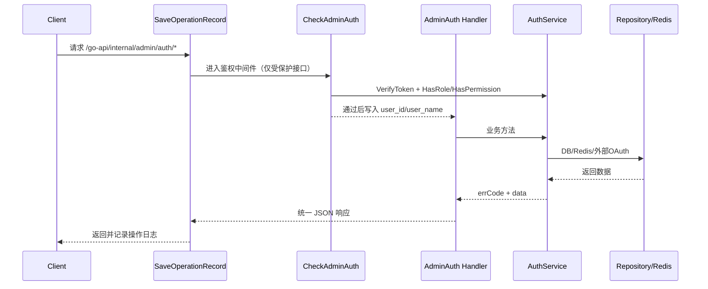

# 鉴权接口文档（Admin Auth）

本文档按当前代码实现整理，覆盖 `app/http/router/internal/admin/auth/auth.go` 中 22 个路由的完整功能、调用链路和数据结构。

## 1. 基础信息

### 1.1 路由前缀
- `app/http/router/handler.go`：注册 `/go-api`
- `app/http/router/internal/handler.go`：注册 `/internal`
- `app/http/router/internal/admin/handler.go`：注册 `/admin`（挂载 `SaveOperationRecord`）
- `app/http/router/internal/admin/auth/handler.go`：注册 `/auth`

Auth 模块业务接口完整前缀：`/go-api/internal/admin/auth`

### 1.2 路由总览（与 `auth.go` 一致）
| 功能 | 方法 | 路径 | 是否经过 `CheckAdminAuth` |
| ---- | ---- | ---- | ---- |
| 获取 OAuth 登录地址 | GET | `/oauth/url` | 否 |
| 换取登录 Token | POST | `/token` | 否 |
| 获取 Passkey 登录挑战 | POST | `/passkey/login/options` | 否 |
| 完成 Passkey 登录 | POST | `/passkey/login/finish` | 否 |
| 本地账号重认证 | POST | `/reauth` | 否 |
| 确认第三方绑定 | POST | `/oauth/bind/confirm` | 否 |
| 查询已绑定第三方 | GET | `/oauth/accounts` | 是 |
| 解绑第三方 | POST | `/oauth/unbind` | 是 |
| 获取 Passkey 注册挑战 | POST | `/passkey/register/options` | 是 |
| 完成 Passkey 注册 | POST | `/passkey/register/finish` | 是 |
| 查询当前用户 Passkey | GET | `/passkeys` | 是 |
| 删除当前用户 Passkey | DELETE | `/passkey` | 是 |
| 获取当前用户信息 | GET | `/profile` | 是 |
| 重置密码（安全码） | PUT | `/password/reset` | 否 |
| 修改密码 | PUT | `/password` | 是 |
| 更新个人资料 | PUT | `/profile` | 是 |
| 获取用户菜单 | GET | `/menus` | 是 |
| 修改登录标识 | PUT | `/identifier` | 是 |
| 开启 TFA | PUT | `/tfa/enable` | 是 |
| 关闭 TFA | PUT | `/tfa/disable` | 是 |
| 获取 TOTP Key | GET | `/tfa/key` | 是 |
| 获取 TFA 状态 | GET | `/tfa/status` | 是 |

### 1.3 通用响应结构
```json
{
  "code": 0,
  "msg": "OK",
  "trace": {
    "id": "f3f7a9f6ee024934",
    "desc": ""
  },
  "data": {}
}
```

## 2. 完整调用链路

### 2.1 鉴权接口（需要登录）


### 2.2 非鉴权接口（公开）
`/oauth/url`、`/token`、`/passkey/login/options`、`/passkey/login/finish`、`/reauth`、`/oauth/bind/confirm`、`/password/reset` 跳过 `CheckAdminAuth`，但仍经过 `SaveOperationRecord`。

## 3. 鉴权与权限机制

### 3.1 Token 解析与校验
来自 `app/http/middleware/check_admin_auth.go`：

1. 先读 Header：`Authorization: Bearer <token>`。
2. Header 无 token 时再读 Cookie：`admin-token=<token>`。
3. 调用 `AuthService.VerifyToken` 做 JWT 校验。
4. 成功后写入上下文：`user_id`、`user_name`。

JWT 使用 `HS256`，过期时间来自 `config.System.Admin.TokenExpireIn`（若 admin 配置为空则回退到系统配置）。

### 3.2 权限校验
1. 先调用 `HasRole(userID, "super_admin")`。
2. 是 `super_admin`：直接放行。
3. 否则计算权限 hash：`MD5(HTTP_METHOD + RequestPathWithoutQuery)`。
4. 调用 `HasPermission(userID, permissionHash)`。

### 3.3 鉴权失败错误码
| Code | 含义 | 触发位置 |
| ---- | ---- | ---- |
| 10001 | 未登录/未携带 token | 中间件默认值（未拿到 token） |
| 11005 | 用户授权已过期 | `jwt.ErrTokenExpired` |
| 11007 | 标识结构异常 | `jwt.ErrTokenMalformed` |
| 11009 | Token 签名无效 | `jwt.ErrTokenSignatureInvalid` |
| 11006 | 用户授权失败 | 其他 token 校验失败 |
| 11008 | 用户权限不足 | 非 super_admin 且无接口权限 |

## 4. 核心数据结构

### 4.1 `AuthParam`（`POST /token` 请求体）
| 字段 | 类型 | 必填 | 说明 |
| ---- | ---- | ---- | ---- |
| identifier | string | 否 | `password` 模式传邮箱/手机号；`totp` 模式传 `safe_code` |
| grant_type | string | 是 | `password` / `totp` / `feishu` / `wechat` |
| state | string | 否 | OAuth 回调 state（`feishu/wechat` 场景使用） |
| credentials | string | 是 | `password` 模式必须传 `md5(明文密码)`；`totp` 模式传验证码；OAuth 模式传 `code` |

### 4.2 `AccessToken`（`POST /token` / `POST /passkey/login/finish` / `POST /oauth/bind/confirm` 成功响应 `data`）
| 字段 | 类型 | 说明 |
| ---- | ---- | ---- |
| safe_code | string | 在 `NeedTfa(11028)` / `NeedResetPWD(11015)` 返回 |
| token | string | 登录成功返回 JWT |
| expires_in | int64 | token 过期秒数 |
| bind_ticket | string | `NeedBindOAuth(11042)` 时返回，用于后续绑定确认 |
| oauth_profile | object | `NeedBindOAuth(11042)` 时返回的第三方资料预览（当前支持 `user_name`、`avatar`） |
| syncable_fields | array | `NeedBindOAuth(11042)` 时返回的可同步字段列表（当前可能包含 `user_name`、`avatar`） |

### 4.2.1 `ReauthResult`（`POST /reauth` 响应 `data`）
| 字段 | 类型 | 说明 |
| ---- | ---- | ---- |
| safe_code | string | 第一阶段密码校验通过但仍需 TFA 时返回，`action=oauth_reauth` |
| reauth_ticket | string | 重认证完成后返回，用于后续绑定/解绑等高风险操作 |

### 4.2.2 `PasskeyOptionsResult`（`POST /passkey/login/options` / `POST /passkey/register/options` 响应 `data`）
| 字段 | 类型 | 说明 |
| ---- | ---- | ---- |
| challenge_id | string | 服务端生成的 challenge 标识，finish 阶段必须原样回传 |
| options | object | WebAuthn 原生 options；前端应直接交给 `navigator.credentials.get` 或 `navigator.credentials.create` |

说明：
- 登录场景返回 `PublicKeyCredentialRequestOptions` 兼容结构。
- 注册场景返回 `PublicKeyCredentialCreationOptions` 兼容结构。

### 4.2.3 `PasskeyItem`（`GET /passkeys` / `POST /passkey/register/finish` 成功响应）
| 字段 | 类型 | 说明 |
| ---- | ---- | ---- |
| id | uint | Passkey 主键 |
| display_name | string | 设备展示名称 |
| aaguid | string | Authenticator AAGUID，十六进制字符串；可能为空 |
| transports | array | 浏览器上报的传输方式，如 `internal`、`hybrid` |
| last_used_at | string/null | 最近一次成功登录时间 |
| created_at | string | 创建时间 |

### 4.2.4 `PasskeyCredential`（`POST /passkey/register/finish` / `POST /passkey/login/finish` 请求体）
| 字段 | 类型 | 必填 | 说明 |
| ---- | ---- | ---- | ---- |
| id | string | 是 | 浏览器返回的 credential id |
| raw_id | string | 否 | 原始 `rawId`；若为空会回退到 `id` |
| type | string | 否 | 默认 `public-key` |
| response | object | 是 | 浏览器返回的 WebAuthn `response` 结构 |

说明：
- `response` 内支持浏览器常见 camelCase 键名，也兼容 snake_case 键名。
- 服务端会将其转换为 WebAuthn 协议对象后再校验。

### 4.3 `safe_code`（Redis 存储结构）
- Redis key：`admin:system:auth:safeCode:{code}`
- value（JSON，按不同 action 携带不同字段）：
  ```json
  {
    "user_id": 1,
    "action": "tfa"
  }
  ```
- `action` 可为：`tfa`、`reset_password`、`oauth_reauth`
- `oauth_reauth` 用途：本地账号 `Reauth` 第一阶段密码校验通过后，若该用户已开启 TFA，则返回一次性 `safe_code` 供第二阶段提交 `totp_code`。
- TTL：`config.System.Admin.SafeCodeExpireIn`
- 一次性消费：`parseSafeCode` 读取后删除

### 4.4 `bind_ticket` / `reauth_ticket`（Redis 存储结构）
- `bind_ticket`
  - key：`admin:system:auth:bindTicket:{code}`
  - value：`provider/provider_tenant/provider_subject/oauth_profile`
  - 用途：第三方身份已验真，但尚未与本地账号建立绑定
- `reauth_ticket`
  - key：`admin:system:auth:reauthTicket:{code}`
  - value：`user_id + action=oauth_reauth`
  - 用途：高风险操作前确认本地账号所有权
- 两类 ticket 都不会在读取时立即消费；`bind_ticket` 会在绑定成功且登录态签发完成后删除，`reauth_ticket` 会在绑定/解绑成功后删除。

### 4.5 OAuth state（Redis 存储结构）
- Redis key：`admin:system:auth:oauth:{state}`
- value：`feishu` 或 `wechat`
- TTL：180 秒
- 在 `POST /token` 的 OAuth 分支成功读取后删除

### 4.5.1 Passkey challenge（Redis 存储结构）
- Redis key：`admin:system:auth:passkey:challenge:{challenge_id}`
- value（JSON）：
  ```json
  {
    "action": "login",
    "user_id": 1,
    "identifier": "admin@example.com",
    "challenge_id": "RANDOM_CHALLENGE_ID",
    "session_data": {},
    "display_name": "MacBook Pro",
    "created_at": 1738838400
  }
  ```
- `action` 可为：`login`、`register`
- TTL：`config.System.Admin.WebAuthn.ChallengeExpireIn`，默认 180 秒
- `POST /passkey/*/finish` 成功或失败返回前都会尝试消费 challenge；challenge 丢失或超时返回 `11050`，内容不匹配返回 `11051`

### 4.6 菜单树结构（`GET /menus` 的 `data.items[]`）
来自 `system.Menu`：

| 字段 | 类型 | 说明 |
| ---- | ---- | ---- |
| ID | uint | 菜单 ID（来自 `gorm.Model`） |
| name | string | 菜单名称 |
| path | string | 菜单路径 |
| permission_id | uint | 关联权限 ID |
| parent_id | uint | 父菜单 ID（0 表示根） |
| icon | string | 图标 |
| sort | int | 排序 |
| children | array | 子菜单（递归同结构） |

说明：结构体嵌入 `gorm.Model`，序列化时还可能包含 `CreatedAt/UpdatedAt/DeletedAt` 字段。

### 4.7 TOTP 相关数据
- `GET /tfa/key` 返回：
  - `totp_key`：32 位 Base32 随机串
  - `qr_code`：`data:image/png;base64,...`
- TOTP 校验参数：6 位验证码，30 秒步长，窗口 `±1` 个时间片。

### 4.8 当前用户信息结构（`GET /profile` 响应 `data`）
| 字段 | 类型 | 说明 |
| ---- | ---- | ---- |
| id | uint | 用户 ID |
| user_name | string | 用户名 |
| avatar | string | 头像 URL |
| email | string | 邮箱 |
| phone | string | 手机号 |
| role_name | string | 角色名称：`超级管理员` / `管理员` / `普通用户` |

`role_name` 判定规则：
- 包含 `super_admin`：`超级管理员`
- 仅包含 `base`：`普通用户`
- 在 `base` 基础上有其他角色（且不包含 `super_admin`）：`管理员`

### 4.9 WebAuthn 配置（`system.admin.webauthn`）
| 字段 | 类型 | 说明 |
| ---- | ---- | ---- |
| rp_id | string | Relying Party ID，Passkey 功能必填 |
| rp_display_name | string | Relying Party 展示名；为空时默认 `Go API Admin` |
| rp_origins | array | 允许的前端来源列表，Passkey 功能必填 |
| challenge_expire_in | int | challenge TTL 秒数，默认 `180` |
| user_verification | string | `required` / `preferred` / `discouraged`，默认 `preferred` |

说明：
- 若 `rp_id` 或 `rp_origins` 未配置，Passkey 注册/登录接口会返回 `500`。
- 示例配置可参考 `bin/configs/dev.json`、`bin/configs/local.json.default`、`bin/configs/prod.json`。

### 4.10 Passkey 日志脱敏约定
- `/passkey/register/finish` 与 `/passkey/login/finish` 不记录原始操作载荷。
- 请求日志会对 `challenge_id`、`credential`、`attestation`、`assertion`、`public_key`、`signature`、`user_handle` 等敏感字段做脱敏。

## 5. 登录与安全流程

### 5.1 标识密码登录（`grant_type=password`）
1. 校验 `identifier/credentials` 非空（否则 `11000`）。
2. 校验 `identifier` 为邮箱或手机号（否则 `11007`）。
3. 查询用户：`identifier(email/phone) + status=1`（不存在 `11002`）。
4. 校验密码：使用 bcrypt 校验前端传入的 `credentials`（失败返回 `11001`）。
5. 若用户已开启 TFA => `11028` 并返回 `safe_code(action=tfa)`。
6. 其余情况生成 JWT 并返回 `token + expires_in`。

### 5.2 TOTP 二次登录（`grant_type=totp`）
1. 参数映射：`identifier=safe_code`，`credentials=totp_code`。
2. 校验 `safe_code` 并要求 `action=tfa`（失败 `11030`）。
3. 校验用户 TOTP（失败 `11029`）。
4. 成功返回 JWT。

### 5.3 重置密码（`PUT /password/reset`）
1. 校验 `safe_code/password` 非空（`11034` / `11032`）。
2. 解析 `safe_code` 且 `action=reset_password`（否则 `11030`）。
3. 更新密码：以 bcrypt 存储 `password`（当前接口口径下，`password` 为前端传入的 `md5(明文密码)`）。

### 5.4 OAuth 登录（飞书/企业微信）
#### 5.4.1 `GET /oauth/url`
- 生成 16 位 `state`，缓存 180 秒。
- 按 `type` 构造重定向 URL：
  - `feishu`
  - `wechat`（`login_type=qrcode` 时走企业微信扫码地址）

#### 5.4.2 `POST /token`（`grant_type=feishu/wechat`）
1. 校验 `state` 与 oauthType 匹配（否则 `11041`）。
2. 通过对应 provider API 换取用户标识。
3. 按 `(provider, provider_tenant, provider_subject)` 查询 `sys_user_identity`。
4. 若已绑定用户，直接生成 JWT，并更新该 identity 的 `last_login_at`。
5. 若第三方未绑定用户，返回 `11042` 且携带 `bind_ticket`。
6. `NeedBindOAuth` 场景会同时返回第三方资料预览与可同步字段列表；前端可让用户勾选本次要同步的字段。

### 5.5 本地账号重认证（`POST /reauth`）
#### 第一阶段：密码校验
1. 传入本地 `identifier + password`。
2. 使用密码验证本地账号所有权。
3. 若用户未开启 TFA，直接返回短期 `reauth_ticket`。
4. 若用户已开启 TFA，返回 `11028`，并携带 `safe_code(action=oauth_reauth)`。

#### 第二阶段：TOTP 校验
1. 传入第一阶段返回的 `safe_code` 与当前 `totp_code`。
2. 校验 `safe_code` 且要求 `action=oauth_reauth`（失败 `11030`）。
3. 查询该 `safe_code` 对应用户，并校验用户仍处于启用状态。
4. 校验用户 TOTP（失败 `11029`）。
5. 成功后返回短期 `reauth_ticket`，仅用于绑定/解绑等高风险操作。

### 5.6 第三方账号绑定确认（`POST /oauth/bind/confirm`）
1. 传入 `bind_ticket` 与 `reauth_ticket`。
2. 校验两张 ticket 均有效，且 `reauth_ticket.action=oauth_reauth`。
3. 在事务中校验目标第三方身份未被其他用户占用。
4. 写入 `sys_user_identity`。
5. 若传入 `sync_fields`，同步对应资料到 `sys_user`。
6. 绑定成功后回查目标用户并直接签发 JWT，返回 `token + expires_in`。
7. 成功后消费两张 ticket。

#### 完整流程：第三方登录绑定本地账号
1. 前端先调用 `GET /oauth/url` 获取第三方授权地址，并跳转到第三方完成授权。
2. 第三方回调后，前端携带 `code + state` 调用 `POST /token`（`grant_type=feishu/wechat`）。
3. 若该第三方身份已绑定本地账号，则 `POST /token` 直接返回 JWT，流程结束。
4. 若该第三方身份尚未绑定本地账号，则 `POST /token` 返回 `11042`，并携带 `bind_ticket + oauth_profile + syncable_fields`。
5. 前端提示用户输入要绑定的本地账号和密码，并调用 `POST /reauth` 第一阶段。
6. 若本地账号未开启 TFA，则 `POST /reauth` 直接返回 `reauth_ticket`。
7. 若本地账号已开启 TFA，则 `POST /reauth` 返回 `11028 + safe_code`；前端继续提示输入 TOTP，再调用 `POST /reauth` 第二阶段换取 `reauth_ticket`。
8. 前端携带 `bind_ticket + reauth_ticket` 调用 `POST /oauth/bind/confirm`；如用户勾选了资料同步项，再附带 `sync_fields`。
9. 绑定成功后，接口会直接返回 JWT，前端应立即建立登录态，无需再额外调用一次登录接口。
10. 此后再次走同一第三方登录时，将直接命中已绑定用户并返回 JWT。

### 5.7 Passkey 登录
1. 前端提交本地登录标识（邮箱或手机号）到 `POST /passkey/login/options`。
2. 服务端校验用户启用状态与已注册 Passkey，返回 `challenge_id + options`。
3. 前端将 `options` 直接传给 `navigator.credentials.get(...)`，获取浏览器返回的 assertion。
4. 前端把 `challenge_id + credential` 提交到 `POST /passkey/login/finish`。
5. 服务端完成 challenge 校验、WebAuthn 签名校验，并回写 `sign_count + last_used_at`，最终返回 `token + expires_in`。

补充说明：
- 登录阶段 `response` 字段应保持浏览器原样透传，服务端同时支持 camelCase 与 snake_case 键名。
- `POST /passkey/login/options` 与 `POST /passkey/login/finish` 走管理端鉴权频控。

### 5.8 已绑定账号查询与解绑
- `GET /oauth/accounts`：返回当前登录用户已绑定的第三方账号列表，每条记录都包含 `id`，前端解绑时必须使用该标识。
- `POST /oauth/unbind`：请求体必须传 `identity_id + reauth_ticket`；服务端只会解绑这条指定 identity，解绑前会校验账号至少保留一种可用登录方式。

### 5.9 Passkey 注册与自主管理
1. 当前登录用户调用 `POST /passkey/register/options`，可选传 `display_name` 自定义设备名。
2. 服务端返回 `challenge_id + options`，前端将 `options` 直接传给 `navigator.credentials.create(...)`。
3. 前端把 `challenge_id + credential` 提交到 `POST /passkey/register/finish`，成功后返回新建 `PasskeyItem`。
4. `GET /passkeys` 可查询当前用户已绑定的全部 Passkey。
5. `DELETE /passkey` 按 `id` 删除单个 Passkey；若删除后将不再保留任何可用登录方式，返回 `11049`。
6. 若 credential 已存在，注册完成阶段返回 `11053`；若凭证验证失败则返回 `11054`。

## 6. 接口明细（逐路由）

## 6.1 获取 OAuth 登录地址
- **Method**：GET
- **Path**：`/go-api/internal/admin/auth/oauth/url`
- **鉴权**：否
- **Query**：

  | 字段 | 类型 | 必填 | 说明 |
  | ---- | ---- | ---- | ---- |
  | type | string | 是 | `feishu` / `wechat` |
  | login_type | string | 否 | `wechat` 可传 `qrcode` |

- **响应**：`data.url`（string）
- **错误码**：`400`、`11040`、`500`

---

## 6.2 换取登录 Token
- **Method**：POST
- **Path**：`/go-api/internal/admin/auth/token`
- **鉴权**：否
- **Body**：`AuthParam`
- **响应**：`AccessToken`
- **OAuth 未绑定时返回示例**：
  ```json
  {
    "code": 11042,
    "msg": "NeedBindOAuth",
    "data": {
      "bind_ticket": "BIND_TICKET",
      "oauth_profile": {
        "user_name": "张三",
        "avatar": "https://example.com/avatar.png"
      },
      "syncable_fields": ["user_name", "avatar"]
    }
  }
  ```
- **错误码（按分支）**：
  - 通用：`400`、`11010`
  - password：`11000`、`11001`、`11002`、`11015`、`11028`
  - totp：`11029`、`11030`、`11002`
  - OAuth：`11041`、`500`

---

## 6.3 获取当前用户信息
- **Method**：GET
- **Path**：`/go-api/internal/admin/auth/profile`
- **鉴权**：是
- **响应**：
  ```json
  {
    "id": 1,
    "user_name": "admin",
    "avatar": "https://...",
    "email": "admin@example.com",
    "phone": "+8613800000000",
    "role_name": "管理员"
  }
  ```
- **role_name 说明**：
  - `超级管理员`：用户角色中包含 `super_admin`
  - `普通用户`：用户角色仅包含 `base`
  - `管理员`：在 `base` 基础上存在其他角色（且不包含 `super_admin`）
- **错误码**：第 3 章鉴权错误码
- **业务边界说明**：按 service 逻辑，用户不存在时应为 `11002`；但当前 handler 会在 `err == nil` 时强制置 `code=0`，因此该场景可能返回 `code=0, data=null`（当前实现行为）。

---

## 6.4 重置密码（安全码）
- **Method**：PUT
- **Path**：`/go-api/internal/admin/auth/password/reset`
- **鉴权**：否
- **Body**：

  | 字段 | 类型 | 必填 | 说明 |
  | ---- | ---- | ---- | ---- |
  | safe_code | string | 是 | `POST /token` 返回的安全码 |
  | password | string | 是 | 新密码，前端必须传 `md5(明文密码)`（服务端使用 bcrypt 存储） |

- **错误码**：`400`、`11032`、`11034`、`11030`、`11002`、`500`

---

## 6.5 修改密码
- **Method**：PUT
- **Path**：`/go-api/internal/admin/auth/password`
- **鉴权**：是
- **Body**：

  | 字段 | 类型 | 必填 | 说明 |
  | ---- | ---- | ---- | ---- |
  | totp_code | string | 条件必填 | 用户已开启 TFA 时必填，传当前用户 TOTP 验证码 |
  | old_password | string | 条件必填 | 用户未开启 TFA 时必填，必须传 `md5(当前明文密码)` |
  | password | string | 是 | 新密码，前端必须传 `md5(新明文密码)`（服务端使用 bcrypt 存储） |

- **校验规则**：
  - 若 `totp_enabled=true`：要求 `totp_code`，并校验 TOTP。
  - 若 `totp_enabled=false`：要求 `old_password`，并校验旧密码是否正确。
- **错误码**：`400`、`11032`、`11033`、`11029`、`11000`、`11001`、`11002`、`500` + 第 3 章鉴权错误码

---

## 6.6 更新个人资料
- **Method**：PUT
- **Path**：`/go-api/internal/admin/auth/profile`
- **鉴权**：是
- **Body**：

  | 字段 | 类型 | 必填 | 说明 |
  | ---- | ---- | ---- | ---- |
  | user_name | string | 否 | 用户名（受保留词规则限制） |
  | avatar | string | 否 | 头像 URL |

- **保留词规则**：`admin/root/administrator/管理员/超级管理员/seakee/super_admin/superAdmin`（前缀或后缀命中均无效）
- **错误码**：`400`、`11007`、`11002`、`500` + 第 3 章鉴权错误码

---

## 6.7 获取用户菜单
- **Method**：GET
- **Path**：`/go-api/internal/admin/auth/menus`
- **鉴权**：是
- **响应**：`data.items`（见 4.5 菜单树结构）
- **权限逻辑**：
  - `super_admin`：返回全部菜单树
  - 普通用户：按角色权限聚合菜单，并自动补齐父级菜单后返回树形结构
- **错误码**：当前控制器将 service 异常统一映射为 `400`，并附带错误信息；另含第 3 章鉴权错误码

---

## 6.8 修改登录标识
- **Method**：PUT
- **Path**：`/go-api/internal/admin/auth/identifier`
- **鉴权**：是
- **Body**：

  | 字段 | 类型 | 必填 | 说明 |
  | ---- | ---- | ---- | ---- |
  | totp_code | string | 条件必填 | 用户已开启 TFA 时必填，传当前用户 TOTP 验证码 |
  | password | string | 条件必填 | 用户未开启 TFA 时必填，必须传 `md5(当前明文密码)`（用于校验请求合法性） |
  | email | string | 否 | 新邮箱（需合法格式） |
  | phone | string | 否 | 新手机号（需合法格式） |

- **校验规则**：
  - 若 `totp_enabled=true`：要求 `totp_code`，并校验 TOTP。
  - 若 `totp_enabled=false`：要求 `password`，并校验密码是否正确。
- **错误码**：`400`、`11007`、`11014`、`11033`、`11029`、`11000`、`11001`、`11002`、`11013`、`500` + 第 3 章鉴权错误码

---

## 6.9 本地账号重认证
- **Method**：POST
- **Path**：`/go-api/internal/admin/auth/reauth`
- **鉴权**：否
- **Body**：

  | 字段 | 类型 | 必填 | 说明 |
  | ---- | ---- | ---- | ---- |
  | identifier | string | 第一阶段必填 | 本地邮箱/手机号 |
  | password | string | 第一阶段必填 | `md5(当前明文密码)` |
  | safe_code | string | 第二阶段必填 | 第一阶段返回的安全码，要求 `action=oauth_reauth` |
  | totp_code | string | 第二阶段必填 | 当前用户 TOTP 验证码 |

- **调用方式**：
  - 第一阶段：只传 `identifier + password`
  - 第二阶段：只传 `safe_code + totp_code`

- **第一阶段请求示例**：
  ```json
  {
    "identifier": "admin@example.com",
    "password": "md5(当前明文密码)"
  }
  ```

- **第一阶段需继续 TFA 时响应示例**：
  ```json
  {
    "safe_code": "SAFE_CODE"
  }
  ```

- **第二阶段请求示例**：
  ```json
  {
    "safe_code": "SAFE_CODE",
    "totp_code": "123456"
  }
  ```

- **成功响应**：
  ```json
  {
    "reauth_ticket": "REAUTH_TICKET"
  }
  ```

- **说明**：
  - 若第一阶段命中 `11028`，表示本地账号密码已通过，但还需要继续提交第二阶段 TOTP。
  - `safe_code` 为一次性凭证，读取校验后即消费，不能重复使用。

- **错误码**：`400`、`11000`、`11001`、`11002`、`11028`、`11030`、`11033`、`11029`、`500`

---

## 6.10 确认绑定第三方
- **Method**：POST
- **Path**：`/go-api/internal/admin/auth/oauth/bind/confirm`
- **鉴权**：否
- **Body**：

  | 字段 | 类型 | 必填 | 说明 |
  | ---- | ---- | ---- | ---- |
  | bind_ticket | string | 是 | `POST /token` 返回的绑定票据 |
  | reauth_ticket | string | 是 | `POST /reauth` 返回的重认证票据 |
  | sync_fields | array | 否 | 用户勾选的同步字段列表；当前支持 `user_name`、`avatar` |

- **请求示例**：
  ```json
  {
    "bind_ticket": "BIND_TICKET",
    "reauth_ticket": "REAUTH_TICKET",
    "sync_fields": ["user_name", "avatar"]
  }
  ```

- **成功响应**：`AccessToken`
  ```json
  {
    "code": 0,
    "msg": "OK",
    "data": {
      "token": "JWT_TOKEN",
      "expires_in": 7200
    }
  }
  ```

- **行为说明**：
  - 该接口是“第三方登录未绑定”链路的最后一步。
  - 绑定成功后会直接签发登录态，前端无需再额外调用 `POST /token`。
  - 若本次勾选 `sync_fields`，返回的 JWT 会基于同步后的最新用户资料生成。

- **错误码**：`400`、`11044`、`11045`、`11046`、`11047`、`11043`、`11002`、`500`

---

## 6.11 查询已绑定第三方
- **Method**：GET
- **Path**：`/go-api/internal/admin/auth/oauth/accounts`
- **鉴权**：是
- **响应**：`data.list[]`

  | 字段 | 类型 | 说明 |
  | ---- | ---- | ---- |
  | id | uint | identity 主键，解绑时必须使用 |
  | provider | string | 第三方类型，如 `feishu` / `wechat` |
  | provider_tenant | string | 第三方租户标识 |
  | display_name | string | 第三方侧展示名称 |
  | avatar_url | string | 第三方侧头像地址 |
  | bound_at | string | 绑定时间 |
  | last_login_at | string | 最近一次通过该身份登录时间 |

- **错误码**：`11002`、`500` + 第 3 章鉴权错误码

---

## 6.12 解绑第三方
- **Method**：POST
- **Path**：`/go-api/internal/admin/auth/oauth/unbind`
- **鉴权**：是
- **Body**：

  | 字段 | 类型 | 必填 | 说明 |
  | ---- | ---- | ---- | ---- |
  | identity_id | uint | 是 | `GET /oauth/accounts` 返回的 identity 主键 |
  | reauth_ticket | string | 是 | `POST /reauth` 返回的重认证票据 |

- **请求示例**：
  ```json
  {
    "identity_id": 12,
    "reauth_ticket": "REAUTH_TICKET"
  }
  ```

- **行为说明**：
  - 服务端按 `identity_id` 精确解绑，不再根据 `provider/provider_tenant` 批量删除。
  - 解绑会物理删除对应 `sys_user_identity` 记录，后续允许重新绑定同一个第三方身份。
  - 若该账号只剩最后一种可用登录方式，则返回 `11049`。

- **错误码**：`400`、`11046`、`11047`、`11048`、`11049`、`11002`、`500` + 第 3 章鉴权错误码

---

## 6.13 获取 Passkey 登录挑战
- **Method**：POST
- **Path**：`/go-api/internal/admin/auth/passkey/login/options`
- **鉴权**：否
- **Body**：

  | 字段 | 类型 | 必填 | 说明 |
  | ---- | ---- | ---- | ---- |
  | identifier | string | 是 | 本地邮箱或手机号 |

- **响应**：`PasskeyOptionsResult`
- **说明**：
  - `data.options` 为 WebAuthn 登录 challenge，前端应直接传给 `navigator.credentials.get(...)`。
  - 该接口启用管理端登录频控。
- **错误码**：`400`、`11014`、`11002`、`11052`、`11056`、`500`

---

## 6.14 完成 Passkey 登录
- **Method**：POST
- **Path**：`/go-api/internal/admin/auth/passkey/login/finish`
- **鉴权**：否
- **Body**：

  | 字段 | 类型 | 必填 | 说明 |
  | ---- | ---- | ---- | ---- |
  | challenge_id | string | 是 | `POST /passkey/login/options` 返回的 challenge 标识 |
  | credential | object | 是 | 浏览器返回的 `PasskeyCredential` |

- **成功响应**：`AccessToken`
- **错误码**：`400`、`11002`、`11050`、`11051`、`11052`、`11054`、`500`

---

## 6.15 获取 Passkey 注册挑战
- **Method**：POST
- **Path**：`/go-api/internal/admin/auth/passkey/register/options`
- **鉴权**：是
- **Body**：

  | 字段 | 类型 | 必填 | 说明 |
  | ---- | ---- | ---- | ---- |
  | display_name | string | 否 | 自定义设备展示名；为空时后端按用户资料自动生成 |

- **响应**：`PasskeyOptionsResult`
- **说明**：
  - `data.options` 为 WebAuthn 注册 challenge，前端应直接传给 `navigator.credentials.create(...)`。
  - 允许空请求体。
- **错误码**：`400`、`11002`、`11055`、`500` + 第 3 章鉴权错误码

---

## 6.16 完成 Passkey 注册
- **Method**：POST
- **Path**：`/go-api/internal/admin/auth/passkey/register/finish`
- **鉴权**：是
- **Body**：

  | 字段 | 类型 | 必填 | 说明 |
  | ---- | ---- | ---- | ---- |
  | challenge_id | string | 是 | `POST /passkey/register/options` 返回的 challenge 标识 |
  | credential | object | 是 | 浏览器返回的 `PasskeyCredential` |

- **成功响应**：`PasskeyItem`
- **错误码**：`400`、`11002`、`11050`、`11051`、`11053`、`11054`、`11055`、`500` + 第 3 章鉴权错误码

---

## 6.17 查询当前用户 Passkey
- **Method**：GET
- **Path**：`/go-api/internal/admin/auth/passkeys`
- **鉴权**：是
- **响应**：`data.list[]`

  | 字段 | 类型 | 说明 |
  | ---- | ---- | ---- |
  | id | uint | Passkey 主键 |
  | display_name | string | 设备展示名 |
  | aaguid | string | Authenticator AAGUID，可能为空 |
  | transports | array | 浏览器上报的传输方式 |
  | last_used_at | string/null | 最近使用时间 |
  | created_at | string | 创建时间 |

- **错误码**：`11002`、`500` + 第 3 章鉴权错误码

---

## 6.18 删除当前用户 Passkey
- **Method**：DELETE
- **Path**：`/go-api/internal/admin/auth/passkey`
- **鉴权**：是
- **Body**：

  | 字段 | 类型 | 必填 | 说明 |
  | ---- | ---- | ---- | ---- |
  | id | uint | 是 | 要删除的 Passkey 主键 |

- **行为说明**：
  - 按当前登录用户 + `id` 精确删除。
  - 若当前账号只剩最后一种可用登录方式，则返回 `11049`。
  - 缺失或非法 `id` 会在 handler 层直接返回 `400`。

- **错误码**：`400`、`11049`、`11052`、`500` + 第 3 章鉴权错误码

---

## 6.19 开启 TFA
- **Method**：PUT
- **Path**：`/go-api/internal/admin/auth/tfa/enable`
- **鉴权**：是
- **Body**：

  | 字段 | 类型 | 必填 | 说明 |
  | ---- | ---- | ---- | ---- |
  | totp_code | string | 是 | 基于 `totp_key` 生成的验证码 |
  | totp_key | string | 是 | 由 `/tfa/key` 获取 |

- **错误码**：`400`、`11035`、`11033`、`11029`、`500` + 第 3 章鉴权错误码

---

## 6.20 关闭 TFA
- **Method**：PUT
- **Path**：`/go-api/internal/admin/auth/tfa/disable`
- **鉴权**：是
- **Body**：

  | 字段 | 类型 | 必填 | 说明 |
  | ---- | ---- | ---- | ---- |
  | totp_code | string | 是 | 当前用户已绑定 TOTP 的验证码 |

- **错误码**：`400`、`11033`、`11029`、`11002`、`500` + 第 3 章鉴权错误码

---

## 6.21 获取 TOTP Key
- **Method**：GET
- **Path**：`/go-api/internal/admin/auth/tfa/key`
- **鉴权**：是
- **响应**：

  | 字段 | 类型 | 说明 |
  | ---- | ---- | ---- |
  | totp_key | string | 新生成的 Base32 密钥（长度 32） |
  | qr_code | string | 对应二维码的 base64 data URL |

- **错误码**：`11002`（用户不存在） + 第 3 章鉴权错误码

---

## 6.22 获取 TFA 状态
- **Method**：GET
- **Path**：`/go-api/internal/admin/auth/tfa/status`
- **鉴权**：是
- **响应**：

  | 字段 | 类型 | 说明 |
  | ---- | ---- | ---- |
  | enable | bool | 当前用户是否开启 TFA |

- **错误码**：`11002`（用户不存在） + 第 3 章鉴权错误码

---

## 7. 参数口径约定（前端必须遵守）

当前实现中，密码相关接口仍要求前端先传 `md5(明文密码)`。服务端会将该摘要使用 bcrypt 存储。

1. `POST /token` 的 `grant_type=password`：`credentials` 必须传 `md5(明文密码)`。
2. `PUT /password/reset`：`password` 必须传 `md5(新明文密码)`。
3. `PUT /password`：
   - `password` 必须传 `md5(新明文密码)`；
   - 未开启 TFA 时，`old_password` 必须传 `md5(当前明文密码)`。
4. `PUT /identifier`（未开启 TFA 时）：`password` 必须传 `md5(当前明文密码)`。
5. `POST /reauth`：
   - 第一阶段传 `identifier + password=md5(当前明文密码)`；
   - 若返回 `11028`，第二阶段必须改传 `safe_code + totp_code`；
   - 不要在第二阶段重复传 `identifier/password`，统一按 `safe_code` 完成 TOTP 校验。
6. `POST /oauth/bind/confirm`：
   - 必须携带 `bind_ticket + reauth_ticket`；
   - 若希望首次绑定时同步第三方资料，可传 `sync_fields`，当前支持 `user_name`、`avatar`；
   - 成功后接口会直接返回 `token + expires_in`，前端应按登录成功处理。
7. `POST /passkey/login/options`：
   - `identifier` 仍然只接受本地邮箱或手机号；
   - 不接受第三方 provider 标识。
8. `POST /passkey/register/finish` / `POST /passkey/login/finish`：
   - `credential` 必须透传浏览器原始 WebAuthn 结果；
   - `rawId/clientDataJSON/attestationObject/authenticatorData/signature/userHandle` 支持 camelCase 与 snake_case 键名。
9. `POST /passkey/register/options`：
   - `display_name` 可选；
   - 若不传，后端会回退到 `user_name` 或当前登录标识，自动生成 `xxx Passkey`。

示例（未开启 TFA 时修改密码）：

```json
{
  "old_password": "md5(当前明文密码)",
  "password": "md5(新明文密码)"
}
```

示例（未开启 TFA 时修改登录标识）：

```json
{
  "password": "md5(当前明文密码)",
  "email": "new_admin@example.com"
}
```
