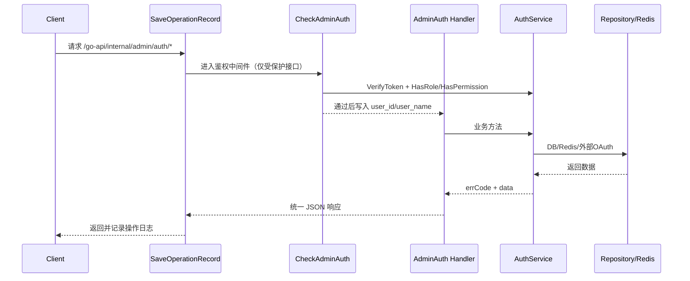

# 鉴权接口文档（Admin Auth）

本文档按当前代码实现整理，覆盖 `app/http/router/internal/admin/auth/auth.go` 中 12 个路由的完整功能、调用链路和数据结构。

## 1. 基础信息

### 1.1 路由前缀
- `app/http/router/handler.go`：注册 `/go-api`
- `app/http/router/internal/handler.go`：注册 `/internal`
- `app/http/router/internal/admin/handler.go`：注册 `/admin`（挂载 `SaveOperationRecord`）
- `app/http/router/internal/admin/auth/handler.go`：注册 `/auth`

Auth 模块业务接口完整前缀：`/go-api/internal/admin/auth`

### 1.2 路由总览（与 `auth.go` 一致）
| 功能 | 方法 | 路径 | 是否经过 `CheckAdminAuth` |
| ---- | ---- | ---- | ---- |
| 获取 OAuth 登录地址 | GET | `/oauth/url` | 否 |
| 换取登录 Token | POST | `/token` | 否 |
| 获取当前用户信息 | GET | `/profile` | 是 |
| 重置密码（安全码） | PUT | `/password/reset` | 否 |
| 修改密码 | PUT | `/password` | 是 |
| 更新个人资料 | PUT | `/profile` | 是 |
| 获取用户菜单 | GET | `/menus` | 是 |
| 修改账号 | PUT | `/account` | 是 |
| 开启 TFA | PUT | `/tfa/enable` | 是 |
| 关闭 TFA | PUT | `/tfa/disable` | 是 |
| 获取 TOTP Key | GET | `/tfa/key` | 是 |
| 获取 TFA 状态 | GET | `/tfa/status` | 是 |

### 1.3 通用响应结构
```json
{
  "code": 0,
  "msg": "OK",
  "trace": {
    "id": "f3f7a9f6ee024934",
    "desc": ""
  },
  "data": {}
}
```

## 2. 完整调用链路

### 2.1 鉴权接口（需要登录）


### 2.2 非鉴权接口（公开）
`/oauth/url`、`/token`、`/password/reset` 跳过 `CheckAdminAuth`，但仍经过 `SaveOperationRecord`。

## 3. 鉴权与权限机制

### 3.1 Token 解析与校验
来自 `app/http/middleware/check_admin_auth.go`：

1. 先读 Header：`Authorization: Bearer <token>`。
2. Header 无 token 时再读 Cookie：`admin-token=<token>`。
3. 调用 `AuthService.VerifyToken` 做 JWT 校验。
4. 成功后写入上下文：`user_id`、`user_name`。

JWT 使用 `HS256`，过期时间来自 `config.System.Admin.TokenExpireIn`（若 admin 配置为空则回退到系统配置）。

### 3.2 权限校验
1. 先调用 `HasRole(userID, "super_admin")`。
2. 是 `super_admin`：直接放行。
3. 否则计算权限 hash：`MD5(HTTP_METHOD + RequestPathWithoutQuery)`。
4. 调用 `HasPermission(userID, permissionHash)`。

### 3.3 鉴权失败错误码
| Code | 含义 | 触发位置 |
| ---- | ---- | ---- |
| 10001 | 未登录/未携带 token | 中间件默认值（未拿到 token） |
| 11005 | 授权已过期 | `jwt.ErrTokenExpired` |
| 11007 | Token 结构异常 | `jwt.ErrTokenMalformed` |
| 11009 | Token 签名无效 | `jwt.ErrTokenSignatureInvalid` |
| 11006 | 授权失败 | 其他 token 校验失败 |
| 11008 | 权限不足 | 非 super_admin 且无接口权限 |

## 4. 核心数据结构

### 4.1 `AuthParam`（`POST /token` 请求体）
| 字段 | 类型 | 必填 | 说明 |
| ---- | ---- | ---- | ---- |
| account | string | 否 | `password` 模式传账号；`totp` 模式传 `safe_code` |
| grant_type | string | 是 | `password` / `totp` / `feishu` / `wechat` |
| state | string | 否 | OAuth 回调 state（`feishu/wechat` 场景使用） |
| credentials | string | 是 | `password` 模式传 `md5(明文密码)`；`totp` 模式传验证码；OAuth 模式传 `code` |

### 4.2 `AccessToken`（`POST /token` 响应 `data`）
| 字段 | 类型 | 说明 |
| ---- | ---- | ---- |
| safe_code | string | 仅在 `NeedTfa(11028)` 或 `NeedResetPWD(11015)` 返回 |
| token | string | 登录成功返回 JWT |
| expires_in | int64 | token 过期秒数 |

### 4.3 `safe_code`（Redis 存储结构）
- Redis key：`admin:system:auth:safeCode:{code}`
- value（JSON）：
  ```json
  {
    "user_id": 1,
    "action": "tfa"
  }
  ```
- `action` 仅有：`tfa`、`reset_password`
- TTL：`config.System.Admin.SafeCodeExpireIn`
- 一次性消费：`parseSafeCode` 读取后删除

### 4.4 OAuth state（Redis 存储结构）
- Redis key：`admin:system:auth:oauth:{state}`
- value：`feishu` 或 `wechat`
- TTL：180 秒
- 在 `verifyByFeishu/verifyByWechat` 成功读取后删除

### 4.5 菜单树结构（`GET /menus` 的 `data.items[]`）
来自 `system.Menu`：

| 字段 | 类型 | 说明 |
| ---- | ---- | ---- |
| ID | uint | 菜单 ID（来自 `gorm.Model`） |
| name | string | 菜单名称 |
| path | string | 菜单路径 |
| permission_id | uint | 关联权限 ID |
| parent_id | uint | 父菜单 ID（0 表示根） |
| icon | string | 图标 |
| sort | int | 排序 |
| children | array | 子菜单（递归同结构） |

说明：结构体嵌入 `gorm.Model`，序列化时还可能包含 `CreatedAt/UpdatedAt/DeletedAt` 字段。

### 4.6 TOTP 相关数据
- `GET /tfa/key` 返回：
  - `totp_key`：32 位 Base32 随机串
  - `qr_code`：`data:image/png;base64,...`
- TOTP 校验参数：6 位验证码，30 秒步长，窗口 `±1` 个时间片。

## 5. 登录与安全流程

### 5.1 账号密码登录（`grant_type=password`）
1. 校验 `account/credentials` 非空（否则 `11000`）。
2. 查询用户：`account + status=1`（不存在 `11002`）。
3. 校验密码：`db_password == MD5(credentials + user.salt)`（失败 `11001`）。
4. 若为初始密码（`DefaultPassword`）=> `11015` 并返回 `safe_code(action=reset_password)`。
5. 若用户已开启 TFA => `11028` 并返回 `safe_code(action=tfa)`。
6. 其余情况生成 JWT 并返回 `token + expires_in`。

### 5.2 TOTP 二次登录（`grant_type=totp`）
1. 参数映射：`account=safe_code`，`credentials=totp_code`。
2. 校验 `safe_code` 并要求 `action=tfa`（失败 `11030`）。
3. 校验用户 TOTP（失败 `11029`）。
4. 成功返回 JWT。

### 5.3 重置密码（`PUT /password/reset`）
1. 校验 `safe_code/password` 非空（`11034` / `11032`）。
2. 解析 `safe_code` 且 `action=reset_password`（否则 `11030`）。
3. 更新密码：仓储层重新生成 salt，并保存 `MD5(password + salt)`。

### 5.4 OAuth 登录（飞书/企业微信）
#### 5.4.1 `GET /oauth/url`
- 生成 16 位 `state`，缓存 180 秒。
- 按 `type` 构造重定向 URL：
  - `feishu`
  - `wechat`（`login_type=qrcode` 时走企业微信扫码地址）

#### 5.4.2 `POST /token`（`grant_type=feishu/wechat`）
1. 校验 `state` 与 oauthType 匹配（否则 `11041`）。
2. 通过对应 provider API 换取用户标识。
3. 按 `feishu_id` / `wechat_id` 查询后台账号并生成 token。

注意：当前实现下，若 OAuth 成功但未匹配到后台账号，接口不会主动返回业务错误码；调用方应以 `code=0` 且 `token` 非空作为成功判定。

## 6. 接口明细（逐路由）

## 6.1 获取 OAuth 登录地址
- **Method**：GET
- **Path**：`/go-api/internal/admin/auth/oauth/url`
- **鉴权**：否
- **Query**：

  | 字段 | 类型 | 必填 | 说明 |
  | ---- | ---- | ---- | ---- |
  | type | string | 是 | `feishu` / `wechat` |
  | login_type | string | 否 | `wechat` 可传 `qrcode` |

- **响应**：`data.url`（string）
- **错误码**：`400`、`11040`、`500`

---

## 6.2 换取登录 Token
- **Method**：POST
- **Path**：`/go-api/internal/admin/auth/token`
- **鉴权**：否
- **Body**：`AuthParam`
- **响应**：`AccessToken`
- **错误码（按分支）**：
  - 通用：`400`、`11010`
  - password：`11000`、`11001`、`11002`、`11015`、`11028`
  - totp：`11029`、`11030`、`11002`
  - OAuth：`11041`、`500`

---

## 6.3 获取当前用户信息
- **Method**：GET
- **Path**：`/go-api/internal/admin/auth/profile`
- **鉴权**：是
- **响应**：
  ```json
  {
    "id": 1,
    "user_name": "admin",
    "avatar": "https://..."
  }
  ```
- **错误码**：第 3 章鉴权错误码
- **业务边界说明**：按 service 逻辑，用户不存在时应为 `11002`；但当前 handler 会在 `err == nil` 时强制置 `code=0`，因此该场景可能返回 `code=0, data=null`（当前实现行为）。

---

## 6.4 重置密码（安全码）
- **Method**：PUT
- **Path**：`/go-api/internal/admin/auth/password/reset`
- **鉴权**：否
- **Body**：

  | 字段 | 类型 | 必填 | 说明 |
  | ---- | ---- | ---- | ---- |
  | safe_code | string | 是 | `POST /token` 返回的安全码 |
  | password | string | 是 | 新密码字符串（会在仓储层加盐+哈希） |

- **错误码**：`400`、`11032`、`11034`、`11030`、`11002`、`500`

---

## 6.5 修改密码
- **Method**：PUT
- **Path**：`/go-api/internal/admin/auth/password`
- **鉴权**：是
- **Body**：

  | 字段 | 类型 | 必填 | 说明 |
  | ---- | ---- | ---- | ---- |
  | totp_code | string | 是 | 当前用户 TOTP 验证码 |
  | password | string | 是 | 新密码字符串（会在仓储层加盐+哈希） |

- **错误码**：`400`、`11032`、`11033`、`11029`、`11002`、`500` + 第 3 章鉴权错误码

---

## 6.6 更新个人资料
- **Method**：PUT
- **Path**：`/go-api/internal/admin/auth/profile`
- **鉴权**：是
- **Body**：

  | 字段 | 类型 | 必填 | 说明 |
  | ---- | ---- | ---- | ---- |
  | user_name | string | 否 | 用户名（受保留词规则限制） |
  | avatar | string | 否 | 头像 URL |

- **保留词规则**：`admin/root/administrator/管理员/超级管理员/seakee/super_admin/superAdmin`（前缀或后缀命中均无效）
- **错误码**：`400`、`11007`、`11002`、`500` + 第 3 章鉴权错误码

---

## 6.7 获取用户菜单
- **Method**：GET
- **Path**：`/go-api/internal/admin/auth/menus`
- **鉴权**：是
- **响应**：`data.items`（见 4.5 菜单树结构）
- **权限逻辑**：
  - `super_admin`：返回全部菜单树
  - 普通用户：按角色权限聚合菜单，并自动补齐父级菜单后返回树形结构
- **错误码**：当前控制器将 service 异常统一映射为 `400`，并附带错误信息；另含第 3 章鉴权错误码

---

## 6.8 修改账号
- **Method**：PUT
- **Path**：`/go-api/internal/admin/auth/account`
- **鉴权**：是
- **Body**：

  | 字段 | 类型 | 必填 | 说明 |
  | ---- | ---- | ---- | ---- |
  | totp_code | string | 是 | 当前用户 TOTP 验证码 |
  | account | string | 是 | 新账号（受保留词规则限制） |

- **错误码**：`400`、`11007`、`11014`、`11033`、`11029`、`11002`、`11013`、`500` + 第 3 章鉴权错误码

---

## 6.9 开启 TFA
- **Method**：PUT
- **Path**：`/go-api/internal/admin/auth/tfa/enable`
- **鉴权**：是
- **Body**：

  | 字段 | 类型 | 必填 | 说明 |
  | ---- | ---- | ---- | ---- |
  | totp_code | string | 是 | 基于 `totp_key` 生成的验证码 |
  | totp_key | string | 是 | 由 `/tfa/key` 获取 |

- **错误码**：`400`、`11035`、`11033`、`11029`、`500` + 第 3 章鉴权错误码

---

## 6.10 关闭 TFA
- **Method**：PUT
- **Path**：`/go-api/internal/admin/auth/tfa/disable`
- **鉴权**：是
- **Body**：

  | 字段 | 类型 | 必填 | 说明 |
  | ---- | ---- | ---- | ---- |
  | totp_code | string | 是 | 当前用户已绑定 TOTP 的验证码 |

- **错误码**：`400`、`11033`、`11029`、`11002`、`500` + 第 3 章鉴权错误码

---

## 6.11 获取 TOTP Key
- **Method**：GET
- **Path**：`/go-api/internal/admin/auth/tfa/key`
- **鉴权**：是
- **响应**：

  | 字段 | 类型 | 说明 |
  | ---- | ---- | ---- |
  | totp_key | string | 新生成的 Base32 密钥（长度 32） |
  | qr_code | string | 对应二维码的 base64 data URL |

- **错误码**：`11002`（用户不存在） + 第 3 章鉴权错误码

---

## 6.12 获取 TFA 状态
- **Method**：GET
- **Path**：`/go-api/internal/admin/auth/tfa/status`
- **鉴权**：是
- **响应**：

  | 字段 | 类型 | 说明 |
  | ---- | ---- | ---- |
  | enable | bool | 当前用户是否开启 TFA |

- **错误码**：`11002`（用户不存在） + 第 3 章鉴权错误码

---

## 7. 参数口径建议（避免联调歧义）

当前实现中，登录分支按 `MD5(credentials + salt)` 做校验，且文档约定 `credentials` 为 `md5(明文密码)`。为避免前后端口径不一致，建议：

1. `POST /token` 的 `grant_type=password` 始终传 `md5(明文密码)`。
2. `PUT /password/reset` 与 `PUT /password` 的 `password` 字段使用与登录一致的口径（建议同样传 `md5(明文密码)`），保证后续登录行为一致。
