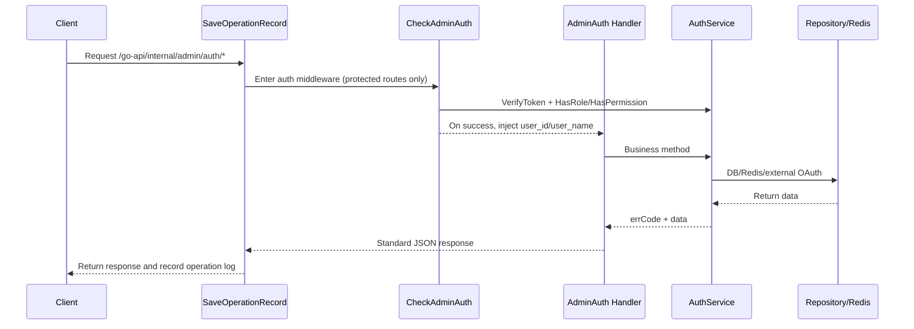

# Admin Auth API Documentation

**Languages**: [English](Admin-Auth.md) | [中文](Admin-Auth-zh.md)

---

This document is based on the current implementation and covers the full behavior, request flows, and data structures of all 27 routes defined in `app/http/router/internal/admin/auth/auth.go`.

## 1. Basic Information

### 1.1 Route Prefixes
- `app/http/router/handler.go`: registers `/go-api`
- `app/http/router/internal/handler.go`: registers `/internal`
- `app/http/router/internal/admin/handler.go`: registers `/admin` (with `SaveOperationRecord`)
- `app/http/router/internal/admin/auth/handler.go`: registers `/auth`

The full business route prefix for the auth module is `/go-api/internal/admin/auth`.

### 1.2 Route Overview (matches `auth.go`)
| Function | Method | Path | Protected by `CheckAdminAuth` |
| ---- | ---- | ---- | ---- |
| Get OAuth login URL | GET | `/oauth/url` | No |
| Exchange login token | POST | `/token` | No |
| Get Passkey login options | POST | `/passkey/login/options` | No |
| Finish Passkey login | POST | `/passkey/login/finish` | No |
| Local account re-authentication | POST | `/reauth` | No |
| Get sensitive-operation verification methods | GET | `/reauth/methods` | Yes |
| Verify sensitive operation with password | POST | `/reauth/password` | Yes |
| Verify sensitive operation with TOTP | POST | `/reauth/totp` | Yes |
| Get Passkey verification options for sensitive operations | POST | `/reauth/passkey/options` | Yes |
| Finish Passkey verification for sensitive operations | POST | `/reauth/passkey/finish` | Yes |
| Confirm third-party binding | POST | `/oauth/bind/confirm` | No |
| List bound third-party accounts | GET | `/oauth/accounts` | Yes |
| Unbind a third-party account | POST | `/oauth/unbind` | Yes |
| Get Passkey registration options | POST | `/passkey/register/options` | Yes |
| Finish Passkey registration | POST | `/passkey/register/finish` | Yes |
| List current user's Passkeys | GET | `/passkeys` | Yes |
| Delete current user's Passkey | DELETE | `/passkey` | Yes |
| Get current user profile | GET | `/profile` | Yes |
| Reset password with safe code | PUT | `/password/reset` | No |
| Change password | PUT | `/password` | Yes |
| Update profile | PUT | `/profile` | Yes |
| Get user menus | GET | `/menus` | Yes |
| Change login identifier | PUT | `/identifier` | Yes |
| Enable TFA | PUT | `/tfa/enable` | Yes |
| Disable TFA | PUT | `/tfa/disable` | Yes |
| Get TOTP key | GET | `/tfa/key` | Yes |
| Get TFA status | GET | `/tfa/status` | Yes |

### 1.3 Common Response Format
```json
{
  "code": 0,
  "msg": "OK",
  "trace": {
    "id": "f3f7a9f6ee024934",
    "desc": ""
  },
  "data": {}
}
```

## 2. End-to-End Call Flow

### 2.1 Protected Endpoints (login required)


### 2.2 Public Endpoints
`/oauth/url`, `/token`, `/passkey/login/options`, `/passkey/login/finish`, `/reauth`, `/oauth/bind/confirm`, and `/password/reset` skip `CheckAdminAuth`, but still pass through `SaveOperationRecord`.

## 3. Auth and Permission Model

### 3.1 Token Parsing and Validation
From `app/http/middleware/check_admin_auth.go`:

1. Read the header first: `Authorization: Bearer <token>`.
2. If the header is missing, read the cookie: `admin-token=<token>`.
3. Call `AuthService.VerifyToken` for JWT validation.
4. On success, write `user_id` and `user_name` into the request context.

JWT uses `HS256`. Expiration comes from `config.System.Admin.TokenExpireIn` and falls back to the system config if the admin config is empty.

### 3.2 Permission Check
1. Call `HasRole(userID, "super_admin")` first.
2. If the user is `super_admin`, allow the request immediately.
3. Otherwise compute the permission hash as `MD5(HTTP_METHOD + RequestPathWithoutQuery)`.
4. Call `HasPermission(userID, permissionHash)`.

### 3.3 Auth Failure Error Codes
| Code | Meaning | Trigger |
| ---- | ---- | ---- |
| 10001 | Not logged in / token missing | Middleware default when no token is found |
| 11005 | User authorization expired | `jwt.ErrTokenExpired` |
| 11007 | Malformed identifier structure | `jwt.ErrTokenMalformed` |
| 11009 | Invalid token signature | `jwt.ErrTokenSignatureInvalid` |
| 11006 | Authorization failed | Other token validation failures |
| 11008 | Insufficient permissions | Not `super_admin` and no permission for the route |

## 4. Core Data Structures

### 4.1 `AuthParam` (`POST /token` request body)
| Field | Type | Required | Description |
| ---- | ---- | ---- | ---- |
| identifier | string | No | Email/phone in `password` mode; `safe_code` in `totp` mode |
| grant_type | string | Yes | `password` / `totp` / `feishu` / `wechat` |
| state | string | No | OAuth callback state, used by `feishu` / `wechat` |
| credentials | string | Yes | Must be `md5(plaintext password)` in `password` mode; verification code in `totp` mode; OAuth `code` in OAuth mode |

### 4.2 `AccessToken` (successful `data` from `POST /token`, `POST /passkey/login/finish`, and `POST /oauth/bind/confirm`)
| Field | Type | Description |
| ---- | ---- | ---- |
| safe_code | string | Returned for `NeedTfa(11028)` or `NeedResetPWD(11015)` |
| token | string | JWT returned on successful login |
| expires_in | int64 | Token expiration in seconds |
| bind_ticket | string | Returned for `NeedBindOAuth(11042)` and used for binding confirmation |
| oauth_profile | object | Preview of the third-party profile returned for `NeedBindOAuth(11042)`; currently supports `user_name` and `avatar` |
| syncable_fields | array | List of fields that can be synced for `NeedBindOAuth(11042)`; currently may include `user_name` and `avatar` |

### 4.2.1 `ReauthResult` (`data` from `POST /reauth`)
| Field | Type | Description |
| ---- | ---- | ---- |
| safe_code | string | Returned when the password step succeeds but TFA is still required, with `action=high_risk_reauth` |
| reauth_ticket | string | Returned after re-auth completes, used for high-risk operations such as binding, unbinding, or deleting Passkeys |

### 4.2.2 `PasskeyOptionsResult` (`data` from `POST /passkey/login/options` and `POST /passkey/register/options`)
| Field | Type | Description |
| ---- | ---- | ---- |
| challenge_id | string | Server-generated verification request identifier that must be sent back unchanged during the finish step |
| options | object | Outer WebAuthn options object; for login it can be passed directly to `navigator.credentials.get(options)`, and for registration to `navigator.credentials.create(options)` |

Notes:
- The login flow returns a `CredentialRequestOptions`-compatible structure where `options.publicKey` is `PublicKeyCredentialRequestOptions`.
- The registration flow returns a `CredentialCreationOptions`-compatible structure where `options.publicKey` is `PublicKeyCredentialCreationOptions`.

### 4.2.3 `PasskeyItem` (successful response from `GET /passkeys` and `POST /passkey/register/finish`)
| Field | Type | Description |
| ---- | ---- | ---- |
| id | uint | Passkey primary key |
| display_name | string | Device display name |
| aaguid | string | Authenticator AAGUID as a hex string; may be empty |
| transports | array | Browser-reported transport methods such as `internal` and `hybrid` |
| last_used_at | string/null | Time of the most recent successful login |
| created_at | string | Creation time |

### 4.2.4 `PasskeyCredential` (`POST /passkey/register/finish` and `POST /passkey/login/finish` request body)
| Field | Type | Required | Description |
| ---- | ---- | ---- | ---- |
| id | string | Yes | Credential ID returned by the browser |
| raw_id | string | No | Original `rawId`; falls back to `id` if empty |
| type | string | No | Defaults to `public-key` |
| response | object | Yes | WebAuthn `response` structure returned by the browser |

Notes:
- `response` supports common browser camelCase keys and also snake_case keys.
- The server converts it to the WebAuthn protocol object before validation.

### 4.3 `safe_code` (Redis storage format)
- Redis key: `admin:system:auth:safeCode:{code}`
- Value (JSON; fields vary by action):
  ```json
  {
    "user_id": 1,
    "action": "tfa"
  }
  ```
- `action` can be `tfa`, `reset_password`, or `high_risk_reauth`
- `high_risk_reauth` is used when the password step of local-account `Reauth` succeeds but the user has TFA enabled; the server returns a one-time `safe_code` for the second-step `totp_code` submission
- TTL: `config.System.Admin.SafeCodeExpireIn`
- One-time consumption: `parseSafeCode` deletes it after reading

### 4.4 `bind_ticket` / `reauth_ticket` (Redis storage format)
- `bind_ticket`
  - key: `admin:system:auth:bindTicket:{code}`
  - value: `provider/provider_tenant/provider_subject/oauth_profile`
  - purpose: the third-party identity is verified, but not yet bound to a local account
- `reauth_ticket`
  - key: `admin:system:auth:reauthTicket:{code}`
  - value: `user_id + action=high_risk_reauth`
  - purpose: confirm ownership of the local account before a high-risk operation
- Neither ticket type is consumed immediately when read. `bind_ticket` is deleted after a successful bind and login issuance. `reauth_ticket` is deleted after binding, unbinding, or deleting the current user's Passkey succeeds.

### 4.5 OAuth State (Redis storage format)
- Redis key: `admin:system:auth:oauth:{state}`
- Value: `feishu` or `wechat`
- TTL: 180 seconds
- Deleted after the OAuth branch of `POST /token` reads it successfully

### 4.5.1 Passkey Verification Request (`challenge`, Redis storage format)
- Redis key: `admin:system:auth:passkey:challenge:{challenge_id}`
- Value (JSON):
  ```json
  {
    "action": "login",
    "challenge_id": "RANDOM_CHALLENGE_ID",
    "session_data": {},
    "created_at": 1738838400
  }
  ```
- `action` can be `login` or `register`
- `user_id` and `display_name` are written only during registration; accountless Passkey login does not pre-bind a user
- TTL: `config.System.Admin.WebAuthn.ChallengeExpireIn`, default `180` seconds
- `POST /passkey/*/finish` attempts to consume the verification request before returning on both success and failure; missing or expired requests return `11050`, and mismatched content returns `11051`

### 4.6 Menu Tree Structure (`data.items[]` from `GET /menus`)
From `system.Menu`:

| Field | Type | Description |
| ---- | ---- | ---- |
| ID | uint | Menu ID (from `gorm.Model`) |
| name | string | Menu name |
| path | string | Menu path |
| permission_id | uint | Linked permission ID |
| parent_id | uint | Parent menu ID (`0` means root) |
| icon | string | Icon |
| sort | int | Sort order |
| children | array | Child menus (recursive same structure) |

Note: the struct embeds `gorm.Model`, so the serialized payload may also contain `CreatedAt`, `UpdatedAt`, and `DeletedAt`.

### 4.7 TOTP-Related Data
- `GET /tfa/key` returns:
  - `totp_key`: a 32-character Base32 random string
  - `qr_code`: `data:image/png;base64,...`
- TOTP validation parameters: 6-digit code, 30-second step, `±1` time-slice window.

### 4.8 Current User Profile Structure (`data` from `GET /profile`)
| Field | Type | Description |
| ---- | ---- | ---- |
| id | uint | User ID |
| user_name | string | User name |
| avatar | string | Avatar URL |
| email | string | Masked email for display only; plaintext is not returned |
| phone | string | Masked phone number for display only; plaintext is not returned |
| role_name | string | Role label, actual response values are `超级管理员`, `管理员`, or `普通用户` |

`role_name` resolution rules:
- Contains `super_admin`: `超级管理员`
- Contains only `base`: `普通用户`
- Contains additional roles on top of `base` without `super_admin`: `管理员`

### 4.9 WebAuthn Configuration (`system.admin.webauthn`)
| Field | Type | Description |
| ---- | ---- | ---- |
| rp_id | string | Relying Party ID. Required for Passkey support. Usually the frontend domain or its parent domain, without protocol, path, or port |
| rp_display_name | string | Relying Party display name. Defaults to `Dudu Admin` when empty |
| rp_origins | array | List of frontend origins allowed to initiate WebAuthn. Required for Passkey support. Every item must be a full origin |
| challenge_expire_in | int | Valid lifetime for a Passkey verification request in seconds. Default `180` |
| user_verification | string | User verification policy: `required`, `preferred`, or `discouraged`. Default `preferred` |

Notes:
- If `rp_id` or `rp_origins` is missing, Passkey registration/login endpoints return `500`.
- The current implementation uses discoverable Passkey login and requires a resident key during registration, so `rp_id` directly determines the credential scope and later subdomain sharing boundary.
- `challenge_expire_in` affects both the Redis TTL of the verification request and the WebAuthn registration/login timeout.
- If `challenge_expire_in <= 0`, it falls back to `180`. If `user_verification` is empty or invalid, it is treated as `preferred`.
- Example configuration can be found in `bin/configs/dev.json`, `bin/configs/local.json.default`, and `bin/configs/prod.json`.

#### `rp_id`
`rp_id` defines the Relying Party domain scope for a Passkey and is one of the most important WebAuthn settings.

- Use a domain or host name such as `localhost`, `127.0.0.1`, `admin.example.com`, or `example.com`.
- Do not use values with protocol, port, or path such as `https://admin.example.com`, `admin.example.com:3000`, or `/login`.
- If the current page runs at `https://a.b.com`, valid choices are usually `a.b.com` or `b.com`; both may be valid, but they produce different scopes:
  - `a.b.com`: narrower scope for the current subdomain only
  - `b.com`: broader scope, suitable only when multiple subdomains must share Passkeys
- Once Passkeys have been issued in production, changing `rp_id` usually requires users to re-register old credentials.

#### `rp_display_name`
`rp_display_name` is the site display name shown by the browser or operating system when requesting a Passkey.

- Use a stable product name such as `Dudu Admin` or `Acme Admin`.
- The backend falls back to `Dudu Admin` when the value is empty.
- This field is not the name of the credential storage provider. It does not determine whether users see `iCloud Keychain`, `Apple Passwords`, `Google Password Manager`, or `Bitwarden`.
- Labels such as `iCloud Keychain` and `Bitwarden` usually describe the credential manager or storage location chosen by the browser, OS, and password manager, not something inferred by this project.

#### `rp_origins`
`rp_origins` is the list of frontend origins allowed to initiate WebAuthn. These values must be frontend page origins, not backend API addresses.

- Every item must be a full origin including protocol, host, and optional port, for example:
  - `http://localhost:3000`
  - `http://127.0.0.1:3000`
  - `https://admin.example.com`
- Do not use values such as `/admin`, `admin.example.com`, `https://admin.example.com/login`, or `https://api.example.com` if they do not match the actual frontend page origin.
- If the admin frontend has multiple valid entry points, include all of them in the array.
- `rp_id` defines credential scope, while `rp_origins` defines which pages may start WebAuthn. Both must be correct.

#### `challenge_expire_in`
`challenge_expire_in` defines how long a Passkey verification request remains valid, in seconds, from generation to expiration.

- Default value: `180`
- The current implementation applies this value to:
  - the TTL of the Passkey challenge in Redis
  - the WebAuthn registration timeout
  - the WebAuthn login timeout
- Recommended values:
  - local development: `180`
  - normal production: `120` to `300`
- Values that are too small may expire before the user completes the system prompt; values that are too large expand the reuse window.

#### `user_verification`
`user_verification` controls whether the authenticator requires local user verification, such as fingerprint, face recognition, or a device PIN.

- `required`: local verification is mandatory; strongest security, stricter compatibility
- `preferred`: local verification is used when available; this is the project default and usually the most balanced choice for admin systems
- `discouraged`: avoid requiring local verification; generally not recommended for high-sensitivity admin backends
- If the value is empty or invalid, the current implementation falls back to `preferred` without raising a dedicated config error

#### Recommended Configuration Examples
Local development:

```json
"webauthn": {
  "rp_id": "localhost",
  "rp_display_name": "Dudu Admin",
  "rp_origins": ["http://localhost:3000"],
  "challenge_expire_in": 180,
  "user_verification": "preferred"
}
```

Single-domain production:

```json
"webauthn": {
  "rp_id": "admin.example.com",
  "rp_display_name": "Dudu Admin",
  "rp_origins": ["https://admin.example.com"],
  "challenge_expire_in": 180,
  "user_verification": "preferred"
}
```

Shared Passkeys across multiple subdomains:

```json
"webauthn": {
  "rp_id": "example.com",
  "rp_display_name": "Dudu Admin",
  "rp_origins": [
    "https://admin.example.com",
    "https://console.example.com"
  ],
  "challenge_expire_in": 180,
  "user_verification": "preferred"
}
```

The last setup is appropriate only when you explicitly want the same Passkey system shared across multiple subdomains. For a single admin domain, prefer a narrower `rp_id`.

### 4.10 Passkey Log Redaction Rules
- `/passkey/register/finish` and `/passkey/login/finish` do not log the raw operation payload.
- Request logging redacts sensitive fields such as `challenge_id`, `credential`, `attestation`, `assertion`, `public_key`, `signature`, and `user_handle`.

## 5. Login and Security Flows

### 5.1 Identifier/Password Login (`grant_type=password`)
1. Validate that `identifier` and `credentials` are not empty, otherwise return `11000`.
2. Validate that `identifier` is an email or phone number, otherwise return `11007`.
3. Query the user by `identifier(email/phone) + status=1`; return `11002` if not found.
4. Validate the password with bcrypt against the frontend-provided `credentials`; return `11001` on failure.
5. If the user has TFA enabled, return `11028` with `safe_code(action=tfa)`.
6. Otherwise generate JWT and return `token + expires_in`.

### 5.2 TOTP Second-Step Login (`grant_type=totp`)
1. Parameter mapping: `identifier=safe_code`, `credentials=totp_code`.
2. Validate `safe_code` and require `action=tfa`; return `11030` on failure.
3. Validate the user's TOTP; return `11029` on failure.
4. Return JWT on success.

### 5.3 Password Reset (`PUT /password/reset`)
1. Validate `safe_code` and `password` are not empty (`11034` / `11032`).
2. Parse `safe_code` and require `action=reset_password`; otherwise return `11030`.
3. Update the password and store it with bcrypt. Under the current API contract, `password` is the frontend-provided `md5(plaintext password)`.

### 5.4 OAuth Login (Feishu / WeCom)
#### 5.4.1 `GET /oauth/url`
- Generate a 16-character `state` and cache it for 180 seconds.
- Build the redirect URL according to `type`:
  - `feishu`
  - `wechat` (use the WeCom QR-code URL when `login_type=qrcode`)

#### 5.4.2 `POST /token` (`grant_type=feishu/wechat`)
1. Validate that `state` matches `oauthType`; otherwise return `11041`.
2. Exchange user identity through the corresponding provider API.
3. Query `sys_user_identity` by `(provider, provider_tenant, provider_subject)`.
4. If the user is already bound, generate JWT immediately and update `last_login_at` on that identity.
5. If the third-party identity is not bound, return `11042` with `bind_ticket`.
6. `NeedBindOAuth` also returns a third-party profile preview and a list of syncable fields, allowing the frontend to let the user choose what to sync.

### 5.5 Local Account Re-authentication (`POST /reauth`)
#### Stage 1: Password validation
1. Submit local `identifier + password`.
2. Verify ownership of the local account with the password.
3. If the user does not have TFA enabled, return a short-lived `reauth_ticket` directly.
4. If the user has TFA enabled, return `11028` with `safe_code(action=high_risk_reauth)`.

#### Stage 2: TOTP validation
1. Submit the `safe_code` returned in stage 1 and the current `totp_code`.
2. Validate `safe_code` and require `action=high_risk_reauth`; return `11030` on failure.
3. Query the user referenced by that `safe_code` and verify the user is still enabled.
4. Validate the user's TOTP; return `11029` on failure.
5. Return a short-lived `reauth_ticket` on success, used only for high-risk operations such as binding, unbinding, or deleting Passkeys.

### 5.5.1 Unified Re-authentication for Sensitive Operations of Logged-in Users
1. The frontend first calls `GET /reauth/methods` to get the current user's available methods, default method, and the `password_requires_totp` flag.
2. If the current user has a Passkey configured, the default method is `passkey`, but the user may still switch manually to the password flow.
3. Passkey flow:
   - Call `POST /reauth/passkey/options` to get `challenge_id + options`
   - The browser runs `navigator.credentials.get(options)`
   - Call `POST /reauth/passkey/finish` to complete validation and exchange `reauth_ticket`
4. Password flow:
   - Call `POST /reauth/password` with the current password
   - If the user does not have TFA enabled, it returns `reauth_ticket` directly
   - If the user has TFA enabled, it returns `11028 + safe_code`
   - Then call `POST /reauth/totp` with `safe_code + totp_code` to exchange `reauth_ticket`
5. The following sensitive operations always require this validation and a valid `reauth_ticket`:
   - Change password
   - Change login identifier
   - Manage third-party accounts
   - Manage Passkeys
   - Manage two-factor authentication

### 5.6 Third-Party Account Binding Confirmation (`POST /oauth/bind/confirm`)
1. Submit `bind_ticket` and `reauth_ticket`.
2. Validate that both tickets are valid and that `reauth_ticket.action=high_risk_reauth`.
3. Inside a transaction, verify that the target third-party identity is not already used by another user.
4. Insert a record into `sys_user_identity`.
5. If `sync_fields` is provided, sync the selected fields into `sys_user`.
6. After a successful bind, query the target user and issue JWT immediately, returning `token + expires_in`.
7. Consume both tickets after success.

#### Full Flow: Bind a Local Account During Third-Party Login
1. The frontend calls `GET /oauth/url` to get the third-party authorization URL, then redirects the user to complete authorization.
2. After the third-party callback, the frontend calls `POST /token` with `code + state` and `grant_type=feishu/wechat`.
3. If the third-party identity is already bound to a local account, `POST /token` returns JWT directly and the flow ends.
4. If it is not bound, `POST /token` returns `11042` with `bind_ticket + oauth_profile + syncable_fields`.
5. The frontend asks the user for the local account and password to bind, then starts stage 1 with `POST /reauth`.
6. If the local account does not have TFA enabled, `POST /reauth` returns `reauth_ticket` directly.
7. If TFA is enabled, `POST /reauth` returns `11028 + safe_code`; the frontend then prompts for TOTP and completes stage 2 to exchange `reauth_ticket`.
8. The frontend calls `POST /oauth/bind/confirm` with `bind_ticket + reauth_ticket`; if the user selected profile sync, also submit `sync_fields`.
9. After a successful bind, the API returns JWT directly. The frontend should establish the login session immediately without calling another login endpoint.
10. Future logins with the same third-party account will directly match the bound user and return JWT.

### 5.7 Passkey Login
1. The frontend calls `POST /passkey/login/options` directly without submitting an account first.
2. The server returns a verification request identifier `challenge_id` and `options`.
3. The frontend passes `options` as the full argument to `navigator.credentials.get(options)` and gets the browser assertion.
4. The frontend submits `challenge_id + credential` to `POST /passkey/login/finish`.
5. The server locates the user by `userHandle` and `credential id`, validates the verification request and WebAuthn signature, updates `sign_count + last_used_at`, and finally returns `token + expires_in`.

Additional notes:
- During login, the `response` field should be forwarded exactly as returned by the browser. The server supports both camelCase and snake_case keys.
- `POST /passkey/login/options` and `POST /passkey/login/finish` are subject to admin-login rate limiting.
- The project does not keep backward compatibility for historical development credentials. After switching to accountless Passkey login, old development Passkeys must be deleted and re-registered.

### 5.8 Querying and Unbinding Bound Accounts
- `GET /oauth/accounts`: returns the list of third-party accounts bound to the current logged-in user, and each record contains `id`; the frontend must use this identifier when unbinding.
- `POST /oauth/unbind`: the request body must contain `identity_id + reauth_ticket`; the server unbinds only that specific identity and checks before deletion that the account still retains at least one available login method.

### 5.9 Passkey Registration and Self-Service Management
1. The current logged-in user must first complete the unified sensitive-operation re-authentication flow, then call `POST /passkey/register/options` with `reauth_ticket`.
2. The server returns a verification request identifier `challenge_id` and `options`, and the frontend passes `options` as the full argument to `navigator.credentials.create(options)`.
3. The frontend submits `challenge_id + credential` to `POST /passkey/register/finish`, which returns the created `PasskeyItem` on success.
4. `GET /passkeys` lists all Passkeys bound to the current user.
5. `DELETE /passkey` requires `id + reauth_ticket` to delete a single Passkey. If that deletion would leave the account with no available login method, the API returns `11049`.
6. If the credential already exists, the registration finish step returns `11053`. If credential verification fails, it returns `11054`.

## 6. Endpoint Details (route by route)

## 6.1 Get OAuth Login URL
- **Method**: GET
- **Path**: `/go-api/internal/admin/auth/oauth/url`
- **Auth**: No
- **Query**:

  | Field | Type | Required | Description |
  | ---- | ---- | ---- | ---- |
  | type | string | Yes | `feishu` / `wechat` |
  | login_type | string | No | `wechat` may pass `qrcode` |

- **Response**: `data.url` (string)
- **Error Codes**: `400`, `11040`, `500`

---

## 6.2 Exchange Login Token
- **Method**: POST
- **Path**: `/go-api/internal/admin/auth/token`
- **Auth**: No
- **Body**: `AuthParam`
- **Response**: `AccessToken`
- **Example when OAuth is not bound**:
  ```json
  {
    "code": 11042,
    "msg": "NeedBindOAuth",
    "data": {
      "bind_ticket": "BIND_TICKET",
      "oauth_profile": {
        "user_name": "张三",
        "avatar": "https://example.com/avatar.png"
      },
      "syncable_fields": ["user_name", "avatar"]
    }
  }
  ```
- **Error codes by branch**:
  - Common: `400`, `11010`
  - password: `11000`, `11001`, `11002`, `11015`, `11028`
  - totp: `11029`, `11030`, `11002`
  - OAuth: `11041`, `500`

---

## 6.3 Get Current User Profile
- **Method**: GET
- **Path**: `/go-api/internal/admin/auth/profile`
- **Auth**: Yes
- **Response**:
  ```json
  {
    "id": 1,
    "user_name": "admin",
    "avatar": "https://...",
    "email": "a***n@e*****e.com",
    "phone": "+86*******0000",
    "role_name": "管理员"
  }
  ```
- **Identifier field notes**:
  - `email` and `phone` are display-only masked values. The response does not expose the plaintext identifiers stored in the database.
  - If the frontend initializes the "change login identifier" form directly from this response, it may send the same masked value back unchanged. The server treats that field as not modified.
- **`role_name` notes**:
  - `超级管理员`: the user's roles include `super_admin`
  - `普通用户`: the user's roles include only `base`
  - `管理员`: the user has roles beyond `base` but not `super_admin`
- **Error Codes**: auth error codes from section 3
- **Business boundary note**: according to the service logic, the missing-user case should be `11002`; however, the current handler forces `code=0` when `err == nil`, so this case may currently return `code=0, data=null`.

---

## 6.4 Reset Password (safe code)
- **Method**: PUT
- **Path**: `/go-api/internal/admin/auth/password/reset`
- **Auth**: No
- **Body**:

  | Field | Type | Required | Description |
  | ---- | ---- | ---- | ---- |
  | safe_code | string | Yes | Safe code returned by `POST /token` |
  | password | string | Yes | New password. The frontend must send `md5(plaintext password)`, which the server stores with bcrypt |

- **Error Codes**: `400`, `11032`, `11034`, `11030`, `11002`, `500`

---

## 6.5 Change Password
- **Method**: PUT
- **Path**: `/go-api/internal/admin/auth/password`
- **Auth**: Yes
- **Body**:

  | Field | Type | Required | Description |
  | ---- | ---- | ---- | ---- |
  | reauth_ticket | string | Yes | Ticket obtained from the unified sensitive-operation verification flow |
  | password | string | Yes | New password. The frontend must send `md5(new plaintext password)`, which the server stores with bcrypt |

- **Validation rules**:
  - The unified sensitive-operation verification flow must be completed first.
  - When a Passkey exists, Passkey is the default preferred method, but the user may manually switch to the password flow.
  - If there is no Passkey and TFA is enabled, the frontend must obtain `reauth_ticket` through the two-step `password -> TOTP` flow.
- **Error Codes**: `400`, `11032`, `11046`, `11047`, `11002`, `500` + auth error codes from section 3

---

## 6.6 Update Profile
- **Method**: PUT
- **Path**: `/go-api/internal/admin/auth/profile`
- **Auth**: Yes
- **Body**:

  | Field | Type | Required | Description |
  | ---- | ---- | ---- | ---- |
  | user_name | string | No | User name, subject to reserved-word rules |
  | avatar | string | No | Avatar URL |

- **Reserved words**: `admin/root/administrator/管理员/超级管理员/seakee/super_admin/superAdmin` (any matching prefix or suffix is invalid)
- **Error Codes**: `400`, `11007`, `11002`, `500` + auth error codes from section 3

---

## 6.7 Get User Menus
- **Method**: GET
- **Path**: `/go-api/internal/admin/auth/menus`
- **Auth**: Yes
- **Response**: `data.items` (see the menu tree structure in 4.6)
- **Permission logic**:
  - `super_admin`: returns the full menu tree
  - Regular users: aggregate menus from role permissions, then automatically include parent menus before returning a tree
- **Error Codes**: the current controller maps service errors uniformly to `400` and includes the error message; auth error codes from section 3 also apply

---

## 6.8 Change Login Identifier
- **Method**: PUT
- **Path**: `/go-api/internal/admin/auth/identifier`
- **Auth**: Yes
- **Body**:

  | Field | Type | Required | Description |
  | ---- | ---- | ---- | ---- |
  | reauth_ticket | string | Yes | Ticket obtained from the unified sensitive-operation verification flow |
  | email | string | No | New email, must be in a valid format |
  | phone | string | No | New phone number, must be in a valid format |

- **Validation rules**:
  - The unified sensitive-operation verification flow must be completed first.
  - Missing or invalid `reauth_ticket` returns `11046 / 11047`.
  - Empty `email` or `phone` means that identifier is not being submitted; if both are empty, return `11014`.
  - If the frontend directly sends back the masked value from `GET /profile`, the server treats that field as unchanged, restores the original value of the current account, and then continues uniqueness and format validation.
  - Only newly entered email or phone values must satisfy format and uniqueness validation.
- **Error Codes**: `400`, `11007`, `11014`, `11046`, `11047`, `11002`, `11013`, `500` + auth error codes from section 3

---

## 6.9 Local Account Re-authentication
- **Method**: POST
- **Path**: `/go-api/internal/admin/auth/reauth`
- **Auth**: No
- **Body**:

  | Field | Type | Required | Description |
  | ---- | ---- | ---- | ---- |
  | identifier | string | Required in stage 1 | Local email or phone |
  | password | string | Required in stage 1 | `md5(current plaintext password)` |
  | safe_code | string | Required in stage 2 | Safe code returned in stage 1, must have `action=high_risk_reauth` |
  | totp_code | string | Required in stage 2 | Current user's TOTP code |

- **Call pattern**:
  - Stage 1: submit only `identifier + password`
  - Stage 2: submit only `safe_code + totp_code`

- **Stage 1 request example**:
  ```json
  {
    "identifier": "admin@example.com",
    "password": "md5(current plaintext password)"
  }
  ```

- **Response example when stage 1 still requires TFA**:
  ```json
  {
    "safe_code": "SAFE_CODE"
  }
  ```

- **Stage 2 request example**:
  ```json
  {
    "safe_code": "SAFE_CODE",
    "totp_code": "123456"
  }
  ```

- **Successful response**:
  ```json
  {
    "reauth_ticket": "REAUTH_TICKET"
  }
  ```

- **Notes**:
  - If stage 1 returns `11028`, it means the local account password has been verified, but stage 2 TOTP is still required.
  - `safe_code` is a one-time credential. It is consumed immediately after validation and cannot be reused.

- **Error Codes**: `400`, `11000`, `11001`, `11002`, `11028`, `11030`, `11033`, `11029`, `500`

---

### 6.9.1 Get Sensitive-Operation Verification Methods
- **Method**: GET
- **Path**: `/go-api/internal/admin/auth/reauth/methods`
- **Auth**: Yes
- **Successful response**:
  - `default_method`: `passkey` / `password`
  - `available_methods`: list of currently available methods
  - `password_requires_totp`: whether the password flow still requires a TOTP step
  - `totp_enabled`: whether the current user has TFA enabled
  - `passkey_count`: number of registered Passkeys for the current user

### 6.9.2 Verify Sensitive Operation with Password
- **Method**: POST
- **Path**: `/go-api/internal/admin/auth/reauth/password`
- **Auth**: Yes
- **Body**:

  | Field | Type | Required | Description |
  | ---- | ---- | ---- | ---- |
  | password | string | Yes | `md5(current plaintext password)` |

- **Behavior**:
  - If the user does not have TFA enabled, return `reauth_ticket` directly
  - If the user has TFA enabled, return `11028 + safe_code`

### 6.9.3 Verify Sensitive Operation with TOTP
- **Method**: POST
- **Path**: `/go-api/internal/admin/auth/reauth/totp`
- **Auth**: Yes
- **Body**:

  | Field | Type | Required | Description |
  | ---- | ---- | ---- | ---- |
  | safe_code | string | Yes | Safe code returned by `POST /reauth/password` |
  | totp_code | string | Yes | Current user's TOTP code |

- **Successful response**:
  ```json
  {
    "reauth_ticket": "REAUTH_TICKET"
  }
  ```

### 6.9.4 Get Passkey Verification Options for Sensitive Operations
- **Method**: POST
- **Path**: `/go-api/internal/admin/auth/reauth/passkey/options`
- **Auth**: Yes
- **Response**: `PasskeyOptionsResult`

### 6.9.5 Finish Passkey Verification for Sensitive Operations
- **Method**: POST
- **Path**: `/go-api/internal/admin/auth/reauth/passkey/finish`
- **Auth**: Yes
- **Body**:

  | Field | Type | Required | Description |
  | ---- | ---- | ---- | ---- |
  | challenge_id | string | Yes | Verification request identifier returned by `POST /reauth/passkey/options` |
  | credential | object | Yes | Browser-returned `PasskeyCredential` |

- **Successful response**:
  ```json
  {
    "reauth_ticket": "REAUTH_TICKET"
  }
  ```

---

## 6.10 Confirm Third-Party Binding
- **Method**: POST
- **Path**: `/go-api/internal/admin/auth/oauth/bind/confirm`
- **Auth**: No
- **Body**:

  | Field | Type | Required | Description |
  | ---- | ---- | ---- | ---- |
  | bind_ticket | string | Yes | Binding ticket returned by `POST /token` |
  | reauth_ticket | string | Yes | Re-authentication ticket returned by `POST /reauth` |
  | sync_fields | array | No | List of fields selected by the user for syncing; currently supports `user_name` and `avatar` |

- **Request example**:
  ```json
  {
    "bind_ticket": "BIND_TICKET",
    "reauth_ticket": "REAUTH_TICKET",
    "sync_fields": ["user_name", "avatar"]
  }
  ```

- **Successful response**: `AccessToken`
  ```json
  {
    "code": 0,
    "msg": "OK",
    "data": {
      "token": "JWT_TOKEN",
      "expires_in": 7200
    }
  }
  ```

- **Behavior notes**:
  - This endpoint is the final step of the "third-party login not yet bound" flow.
  - After a successful bind, it issues the login session directly. The frontend does not need to call `POST /token` again.
  - If `sync_fields` is selected, the returned JWT is generated from the latest synced user profile.

- **Error Codes**: `400`, `11044`, `11045`, `11046`, `11047`, `11043`, `11002`, `500`

---

## 6.11 List Bound Third-Party Accounts
- **Method**: GET
- **Path**: `/go-api/internal/admin/auth/oauth/accounts`
- **Auth**: Yes
- **Response**: `data.list[]`

  | Field | Type | Description |
  | ---- | ---- | ---- |
  | id | uint | Identity primary key, required when unbinding |
  | provider | string | Third-party provider such as `feishu` / `wechat` |
  | provider_tenant | string | Third-party tenant identifier |
  | display_name | string | Display name on the third-party side |
  | avatar_url | string | Avatar URL on the third-party side |
  | bound_at | string | Bind time |
  | last_login_at | string | Most recent login time through that identity |

- **Error Codes**: `11002`, `500` + auth error codes from section 3

---

## 6.12 Unbind Third-Party Account
- **Method**: POST
- **Path**: `/go-api/internal/admin/auth/oauth/unbind`
- **Auth**: Yes
- **Body**:

  | Field | Type | Required | Description |
  | ---- | ---- | ---- | ---- |
  | identity_id | uint | Yes | Identity primary key returned by `GET /oauth/accounts` |
  | reauth_ticket | string | Yes | Re-authentication ticket returned by `POST /reauth` |

- **Request example**:
  ```json
  {
    "identity_id": 12,
    "reauth_ticket": "REAUTH_TICKET"
  }
  ```

- **Behavior notes**:
  - The server unbinds precisely by `identity_id`; it no longer deletes in batch by `provider/provider_tenant`.
  - Unbinding physically deletes the corresponding `sys_user_identity` record, so the same third-party identity can be bound again later.
  - If the account would be left with only zero available login methods, the API returns `11049`.

- **Error Codes**: `400`, `11046`, `11047`, `11048`, `11049`, `11002`, `500` + auth error codes from section 3

---

## 6.13 Get Passkey Login Options
- **Method**: POST
- **Path**: `/go-api/internal/admin/auth/passkey/login/options`
- **Auth**: No
- **Response**: `PasskeyOptionsResult`
- **Notes**:
  - `data.options` is the outer WebAuthn login options object and can be passed directly to `navigator.credentials.get(data.options)`.
  - No account identifier is required. The server generates the options needed for discoverable Passkey login.
  - This endpoint is protected by admin-login rate limiting.
- **Error Codes**: `400`, `11056`, `500`

---

## 6.14 Finish Passkey Login
- **Method**: POST
- **Path**: `/go-api/internal/admin/auth/passkey/login/finish`
- **Auth**: No
- **Body**:

  | Field | Type | Required | Description |
  | ---- | ---- | ---- | ---- |
  | challenge_id | string | Yes | Verification request identifier returned by `POST /passkey/login/options` |
  | credential | object | Yes | Browser-returned `PasskeyCredential` |

- **Successful response**: `AccessToken`
- **Error Codes**: `400`, `11002`, `11050`, `11051`, `11052`, `11054`, `500`

---

## 6.15 Get Passkey Registration Options
- **Method**: POST
- **Path**: `/go-api/internal/admin/auth/passkey/register/options`
- **Auth**: Yes
- **Body**:

  | Field | Type | Required | Description |
  | ---- | ---- | ---- | ---- |
  | reauth_ticket | string | Yes | Ticket obtained from the unified sensitive-operation verification flow |
  | display_name | string | No | Custom device display name. When empty, the backend generates it from the user profile |

- **Response**: `PasskeyOptionsResult`
- **Notes**:
  - `data.options` is the outer WebAuthn registration options object and can be passed directly to `navigator.credentials.create(data.options)`.
  - This endpoint consumes `reauth_ticket` after the challenge is generated successfully.
- **Error Codes**: `400`, `11002`, `11046`, `11047`, `11055`, `500` + auth error codes from section 3

---

## 6.16 Finish Passkey Registration
- **Method**: POST
- **Path**: `/go-api/internal/admin/auth/passkey/register/finish`
- **Auth**: Yes
- **Body**:

  | Field | Type | Required | Description |
  | ---- | ---- | ---- | ---- |
  | challenge_id | string | Yes | Verification request identifier returned by `POST /passkey/register/options` |
  | credential | object | Yes | Browser-returned `PasskeyCredential` |

- **Successful response**: `PasskeyItem`
- **Error Codes**: `400`, `11002`, `11050`, `11051`, `11053`, `11054`, `11055`, `500` + auth error codes from section 3

---

## 6.17 List Current User's Passkeys
- **Method**: GET
- **Path**: `/go-api/internal/admin/auth/passkeys`
- **Auth**: Yes
- **Response**: `data.list[]`

  | Field | Type | Description |
  | ---- | ---- | ---- |
  | id | uint | Passkey primary key |
  | display_name | string | Device display name |
  | aaguid | string | Authenticator AAGUID, may be empty |
  | transports | array | Browser-reported transport methods |
  | last_used_at | string/null | Last usage time |
  | created_at | string | Creation time |

- **Error Codes**: `11002`, `500` + auth error codes from section 3

---

## 6.18 Delete Current User's Passkey
- **Method**: DELETE
- **Path**: `/go-api/internal/admin/auth/passkey`
- **Auth**: Yes
- **Body**:

  | Field | Type | Required | Description |
  | ---- | ---- | ---- | ---- |
  | id | uint | Yes | Passkey primary key to delete |
  | reauth_ticket | string | Yes | Re-authentication ticket returned by `POST /reauth` |

- **Behavior notes**:
  - Deletes precisely by current logged-in user + `id`.
  - A high-risk re-authentication must be completed first and `reauth_ticket` must be submitted.
  - If the current account would be left with no available login method, the API returns `11049`.
  - Missing or invalid `id/reauth_ticket` is rejected directly at the handler layer with `400`.

- **Error Codes**: `400`, `11046`, `11047`, `11049`, `11052`, `500` + auth error codes from section 3

---

## 6.19 Enable TFA
- **Method**: PUT
- **Path**: `/go-api/internal/admin/auth/tfa/enable`
- **Auth**: Yes
- **Body**:

  | Field | Type | Required | Description |
  | ---- | ---- | ---- | ---- |
  | reauth_ticket | string | Yes | Ticket obtained from the unified sensitive-operation verification flow |
  | totp_code | string | Yes | Verification code generated from `totp_key` |
  | totp_key | string | Yes | Obtained from `/tfa/key` |

- **Error Codes**: `400`, `11035`, `11033`, `11029`, `11046`, `11047`, `500` + auth error codes from section 3

---

## 6.20 Disable TFA
- **Method**: PUT
- **Path**: `/go-api/internal/admin/auth/tfa/disable`
- **Auth**: Yes
- **Body**:

  | Field | Type | Required | Description |
  | ---- | ---- | ---- | ---- |
  | reauth_ticket | string | Yes | Ticket obtained from the unified sensitive-operation verification flow |

- **Error Codes**: `400`, `11046`, `11047`, `11002`, `500` + auth error codes from section 3

---

## 6.21 Get TOTP Key
- **Method**: GET
- **Path**: `/go-api/internal/admin/auth/tfa/key`
- **Auth**: Yes
- **Response**:

  | Field | Type | Description |
  | ---- | ---- | ---- |
  | totp_key | string | Newly generated Base32 secret, length 32 |
  | qr_code | string | Base64 data URL of the corresponding QR code |

- **Error Codes**: `11002` (user not found) + auth error codes from section 3

---

## 6.22 Get TFA Status
- **Method**: GET
- **Path**: `/go-api/internal/admin/auth/tfa/status`
- **Auth**: Yes
- **Response**:

  | Field | Type | Description |
  | ---- | ---- | ---- |
  | enable | bool | Whether the current user has TFA enabled |

- **Error Codes**: `11002` (user not found) + auth error codes from section 3

---

## 7. Parameter Contract (frontend must follow)

In the current implementation, password-related APIs still require the frontend to submit `md5(plaintext password)` first. The server stores that digest with bcrypt.

1. For `POST /token` with `grant_type=password`, `credentials` must be `md5(plaintext password)`.
2. For `PUT /password/reset`, `password` must be `md5(new plaintext password)`.
3. Sensitive security operations for logged-in users now all follow the "verify first, then submit `reauth_ticket`" pattern:
   - Call `GET /reauth/methods` to get the default method.
   - Passkey flow: `POST /reauth/passkey/options` -> `POST /reauth/passkey/finish`.
   - Password flow: `POST /reauth/password`, and if necessary `POST /reauth/totp`.
4. `PUT /password`, `PUT /identifier`, `PUT /tfa/enable`, `PUT /tfa/disable`, `POST /passkey/register/options`, and `DELETE /passkey`:
   - must carry `reauth_ticket`
   - `PUT /password` still requires `password=md5(new plaintext password)`
5. `POST /reauth`:
   - stage 1 sends `identifier + password=md5(current plaintext password)`
   - if `11028` is returned, stage 2 must switch to `safe_code + totp_code`
   - do not resend `identifier/password` in stage 2; complete the TOTP check through `safe_code`
6. `POST /reauth/password`:
   - `password` must be `md5(current plaintext password)`
   - if `11028` is returned, continue with `safe_code + totp_code` on `POST /reauth/totp`
7. `POST /oauth/bind/confirm`:
   - must carry `bind_ticket + reauth_ticket`
   - if third-party profile fields should be synced during the first bind, send `sync_fields`, currently supporting `user_name` and `avatar`
   - on success, the endpoint returns `token + expires_in` directly and the frontend should treat it as a successful login
8. `POST /passkey/login/options`:
   - does not require an account identifier
   - old development Passkeys must be deleted and re-registered to reliably support accountless login
9. `POST /passkey/register/finish`, `POST /passkey/login/finish`, and `POST /reauth/passkey/finish`:
   - `credential` must forward the raw browser WebAuthn result
   - `rawId`, `clientDataJSON`, `attestationObject`, `authenticatorData`, `signature`, and `userHandle` support both camelCase and snake_case keys
10. `POST /passkey/register/options`:
   - must be called only after completing the unified sensitive-operation verification flow and with a valid `reauth_ticket`
   - `display_name` is optional
   - if omitted, the backend falls back to `user_name` or the current login identifier and auto-generates `xxx Passkey`
11. `DELETE /passkey`:
   - must first complete the unified sensitive-operation verification flow to obtain `reauth_ticket`
   - the request body must contain `id + reauth_ticket`

Example: change password after completing sensitive-operation verification through the password flow:

```json
{
  "reauth_ticket": "REAUTH_TICKET",
  "password": "md5(new plaintext password)"
}
```

Example: update login identifier after completing unified verification:

```json
{
  "reauth_ticket": "REAUTH_TICKET",
  "email": "new_admin@example.com"
}
```
