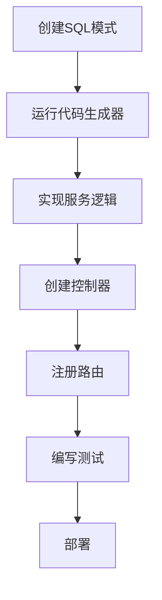

# Go-API框架Wiki

欢迎来到Go-API框架Wiki！这个综合文档将帮助您理解、使用和贡献Go-API框架。

### 📚 文档索引

#### 🏗️ 架构与设计
- **[架构设计](Architecture-Design-zh.md)** - 框架分层架构、设计模式和核心组件的全面概述
- **[开发指南](Development-Guide-zh.md)** - 开发者完整指南，包括设置、工作流程和最佳实践

#### 🚀 快速开始
- **[快速开始指南](../README-zh.md#快速开始)** - 几分钟内启动并运行Go-API
- **[项目设置](Development-Guide-zh.md#项目设置)** - 不同环境的详细设置说明

#### 📖 指南与教程
- **[开发指南](Development-Guide-zh.md)** - 逐步开发工作流程
- **[代码生成器指南](Code-Generator-Guide-zh.md)** - 强大的SQL到Go代码生成工具
- **[部署指南](Deployment-Guide-zh.md)** - 使用Docker和Kubernetes的生产部署

#### 🔌 API参考
- **[API文档](API-Documentation-zh.md)** - 完整的API参考和示例
- **[认证系统](API-Documentation-zh.md#认证)** - 基于JWT的认证系统

#### 🛠️ 工具与特性
- **[代码生成](Code-Generator-Guide-zh.md)** - 自动模型和仓库生成
- **[Makefile使用指南](Makefile-Usage.md)** - 构建自动化和开发工具
- **[go-api.sh使用指南](go-api.sh-Usage.md)** - Shell脚本替代方案
- **[中间件系统](Development-Guide-zh.md#中间件开发)** - 自定义中间件开发
- **[配置管理](Development-Guide-zh.md#配置)** - 多环境配置

#### 🚀 部署与运维
- **[Docker部署](Deployment-Guide-zh.md#docker-部署)** - 容器化部署指南
- **[Kubernetes](Deployment-Guide-zh.md#kubernetes-部署)** - 云原生部署
- **[监控与日志](Deployment-Guide-zh.md#监控和日志)** - 生产环境监控设置

### 🎯 快速导航

| 主题 | 描述 | 链接 |
|------|------|------|
| **快速开始** | Go-API新手？从这里开始 | [快速开始](../README-zh.md#快速开始) |
| **架构设计** | 理解框架设计 | [架构设计](Architecture-Design-zh.md) |
| **开发指南** | 学习开发工作流程 | [开发指南](Development-Guide-zh.md) |
| **API参考** | API端点和使用方法 | [API文档](API-Documentation-zh.md) |
| **代码生成** | 自动代码生成 | [代码生成器](Code-Generator-Guide-zh.md) |
| **Makefile工具** | 构建自动化工具 | [Makefile使用指南](Makefile-Usage.md) |
| **Shell脚本工具** | go-api.sh脚本使用 | [go-api.sh使用指南](go-api.sh-Usage.md) |
| **部署指南** | 生产环境部署 | [部署指南](Deployment-Guide-zh.md) |

### 🌟 核心特性

- **🚀 高性能** - 基于Gin框架，具有优化的组件
- **🏗️ 分层架构** - 清晰的关注点分离，采用Model → Repository → Service → Controller模式
- **🔧 依赖注入** - 适当的DI实现，提高可测试性
- **⚙️ 配置管理** - 多环境配置支持
- **📝 高级日志** - 使用Zap的结构化日志
- **🗄️ 多数据库** - MySQL (GORM) 和 MongoDB (qmgo) 支持
- **🔐 JWT认证** - 内置安全认证系统
- **🌐 国际化** - 多语言支持（中文、英文）
- **🎛️ 中间件系统** - CORS、认证、日志的综合中间件
- **⚡ 代码生成** - 从SQL自动生成模型/仓库
- **📊 监控** - 内置监控和告警功能

### 🛠️ 开发工作流程

### 🔗 外部资源

- **[GitHub仓库](https://github.com/seakee/go-api)** - 源代码和问题跟踪
- **[Go官方文档](https://golang.org/doc/)** - Go语言官方文档
- **[Gin框架](https://gin-gonic.com/)** - Web框架文档
- **[GORM](https://gorm.io/)** - ORM库文档

### 🤝 贡献

我们欢迎贡献！请查看我们的[贡献指南](../CONTRIBUTING.md)了解详情：

- 代码标准和风格指南
- 拉取请求流程
- 问题报告
- 开发环境设置

### 📞 支持与社区

- **问题**: [GitHub Issues](https://github.com/seakee/go-api/issues)
- **讨论**: [GitHub Discussions](https://github.com/seakee/go-api/discussions)
- **邮箱**: seakee23@gmail.com

### 📄 许可证

本项目采用MIT许可证 - 查看[LICENSE](../LICENSE)文件了解详情。