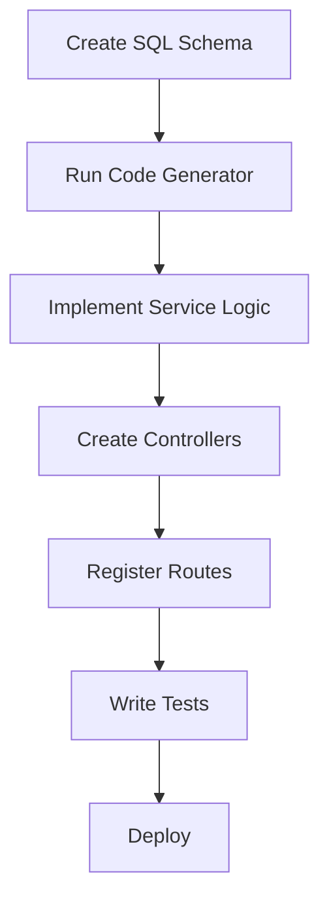

# Go-API Framework Wiki

**Languages**: [English](Home.md) | [中文](Home-zh.md)

---

Welcome to the Go-API Framework Wiki! This comprehensive documentation will help you understand, use, and contribute to the Go-API framework.

### 📚 Documentation Index

#### 🏗️ Architecture & Design
- **[Architecture Design](Architecture-Design.md)** - Comprehensive overview of the framework's layered architecture, design patterns, and core components
- **[Development Guide](Development-Guide.md)** - Complete guide for developers including setup, workflow, and best practices

#### 🚀 Getting Started
- **[Quick Start Guide](../README.md#quick-start)** - Get up and running with Go-API in minutes
- **[Project Setup](Development-Guide.md#project-setup)** - Detailed setup instructions for different environments

#### 📖 Guides & Tutorials
- **[Development Guide](Development-Guide.md)** - Step-by-step development workflow
- **[Code Generator Guide](Code-Generator-Guide.md)** - Powerful SQL-to-Go code generation tool
- **[Deployment Guide](Deployment-Guide.md)** - Production deployment with Docker and Kubernetes

#### 🔌 API Reference
- **[API Documentation](API-Documentation.md)** - Complete API reference with examples
- **[Authentication](API-Documentation.md#authentication)** - JWT-based authentication system

#### 🛠️ Tools & Features
- **[Code Generation](Code-Generator-Guide.md)** - Automatic model and repository generation
- **[Middleware System](Development-Guide.md#middleware-development)** - Custom middleware development
- **[Configuration Management](Development-Guide.md#configuration)** - Multi-environment configuration
- **[Makefile Usage](Makefile-Usage.md)** - Complete guide to using Makefile for development
- **[go-api.sh Usage](go-api.sh-Usage.md)** - Shell script alternative to Makefile

#### 🚀 Deployment & Operations
- **[Docker Deployment](Deployment-Guide.md#docker-deployment)** - Containerized deployment guide
- **[Kubernetes](Deployment-Guide.md#kubernetes-deployment)** - Cloud-native deployment
- **[Monitoring & Logging](Deployment-Guide.md#monitoring-and-logging)** - Production monitoring setup

### 🎯 Quick Navigation

| Topic | Description | Link |
|-------|-------------|------|
| **Getting Started** | New to Go-API? Start here | [Quick Start](../README.md#quick-start) |
| **Architecture** | Understand the framework design | [Architecture Design](Architecture-Design.md) |
| **Development** | Learn development workflow | [Development Guide](Development-Guide.md) |
| **API Reference** | API endpoints and usage | [API Documentation](API-Documentation.md) |
| **Code Generation** | Automatic code generation | [Code Generator](Code-Generator-Guide.md) |
| **Deployment** | Production deployment | [Deployment Guide](Deployment-Guide.md) |
| **Makefile** | Build automation guide | [Makefile Usage](Makefile-Usage.md) |
| **Shell Script** | Alternative build script | [go-api.sh Usage](go-api.sh-Usage.md) |

### 🌟 Key Features

- **🚀 High Performance** - Built on Gin framework with optimized components
- **🏗️ Layered Architecture** - Clean separation of concerns with Model → Repository → Service → Controller pattern
- **🔧 Dependency Injection** - Proper DI implementation for better testability
- **⚙️ Configuration Management** - Multi-environment configuration support
- **📝 Advanced Logging** - Structured logging with Zap
- **🗄️ Multi-Database** - MySQL (GORM) and MongoDB (qmgo) support
- **🔐 JWT Authentication** - Built-in secure authentication system
- **🌐 Internationalization** - Multi-language support (Chinese, English)
- **🎛️ Middleware System** - Comprehensive middleware for CORS, auth, logging
- **⚡ Code Generation** - Automatic model/repository generation from SQL
- **📊 Monitoring** - Built-in monitoring and alerting capabilities

### 🛠️ Development Workflow

### 🔗 External Resources

- **[GitHub Repository](https://github.com/seakee/go-api)** - Source code and issues
- **[Go Documentation](https://golang.org/doc/)** - Official Go documentation
- **[Gin Framework](https://gin-gonic.com/)** - Web framework documentation
- **[GORM](https://gorm.io/)** - ORM library documentation

### 🤝 Contributing

We welcome contributions! Please see our [Contributing Guidelines](../CONTRIBUTING.md) for details on:

- Code standards and style guide
- Pull request process
- Issue reporting
- Development setup

### 📞 Support & Community

- **Issues**: [GitHub Issues](https://github.com/seakee/go-api/issues)
- **Discussions**: [GitHub Discussions](https://github.com/seakee/go-api/discussions)
- **Email**: seakee23@gmail.com

### License

This project is licensed under the MIT License - see the [LICENSE](../LICENSE) file for details.